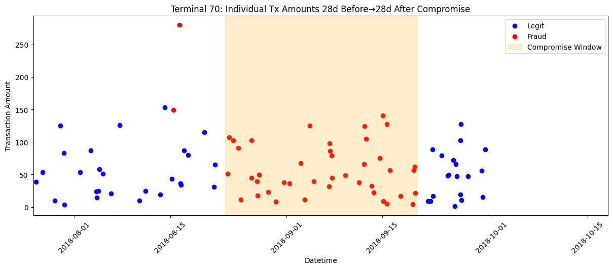
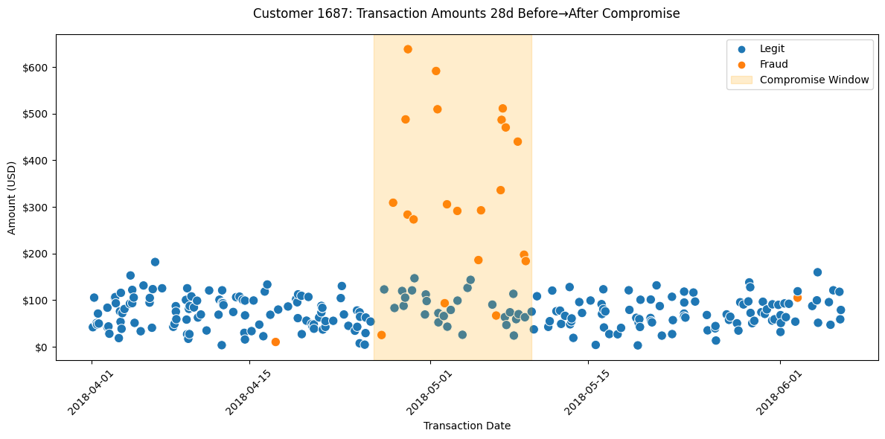
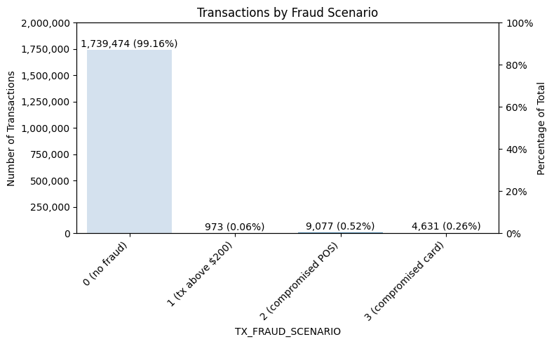
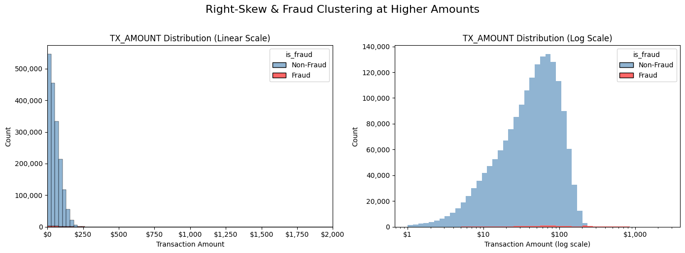
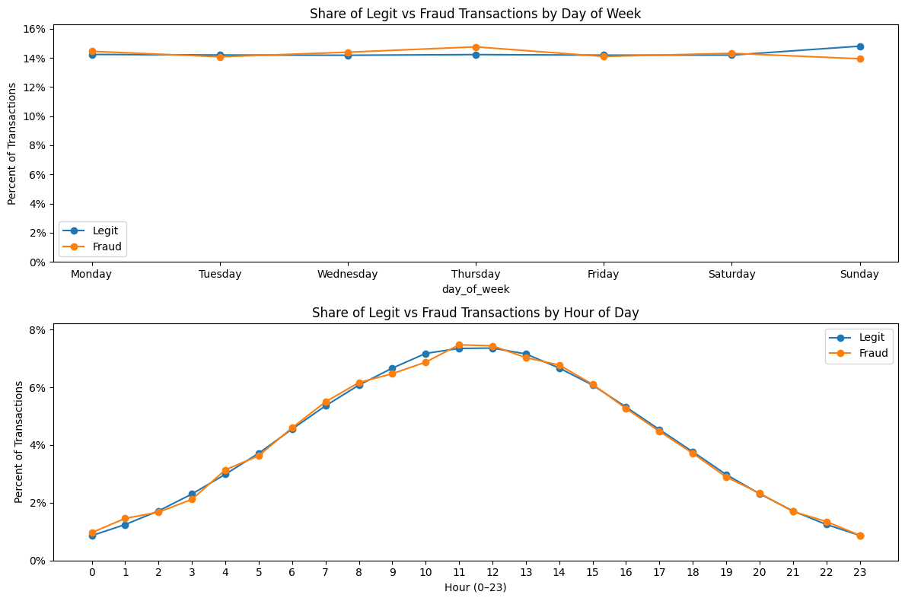
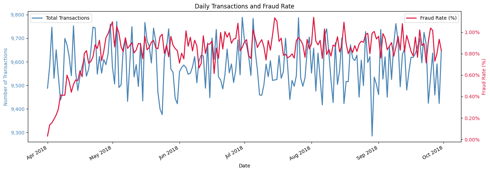
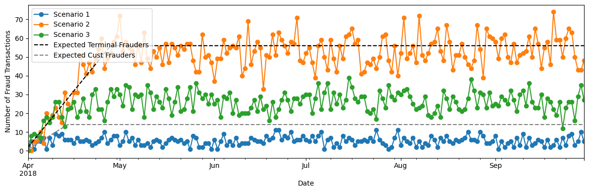
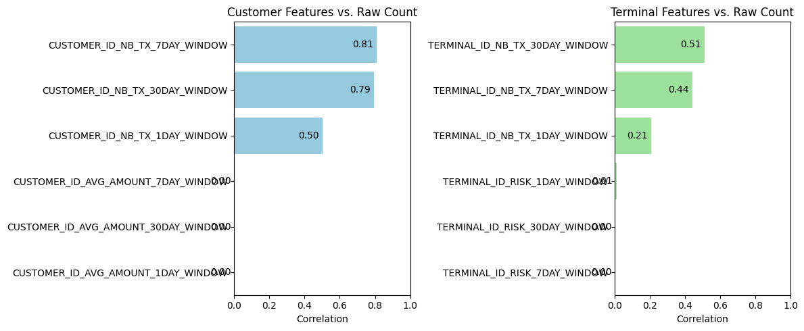

# 3. The dataset we’ll use (primarily)

I’ll be working with the synthetic dataset from the Fraud Detection Handbook.[^1] It’s designed to mirror real-world transaction streams and already includes several engineered features. Crucially, it simulates two common fraud scenarios—compromised point-of-sale devices and compromised cards—so I can see how models react to different attack patterns.

In total there are 1.75 million transactions, 3 ID columns (for the customer, terminal/point-of-sale, and transaction), 2 raw features (datetime & amount of transaction, and 17 engineered features. There is a binary fraud indicator and a column indicating which of three engineered fraud scenarios a fraud exhibits.

## 3.1 How transactions were generated 

The transactions were generated in a manner that incorporates common aspects of credit card transactions:

- People tend to make purchases reasonably close to home. (The simulation incorporates this by putting people’s “homes” and merchant terminals on a grid and generating transactions for a given person at terminals within a fixed radius of their “home”.)

- How often people use their cards and how much they tend to spend varies from person to person. (The simulation handles this by generating, for each person, a daily transaction rate from Uniform(0,4), and an average transaction amount from Uniform(5,100). It then generates daily transactions as a Poisson process with the selected average transaction rate and selects the amount for a given transaction from N(μ, √μ/√ 2) . The terminal is selected randomly within the radius.

- Fraud occurs more often in the wee hours. (The simulation handles this by selecting the time at which the transaction takes place from a normal distribution centered at midnight, with a standard deviation of 20,000 seconds (about 5.5 hours), discarding selections that fall outside the 24-hour window.)

The result was 1.75 million transactions over a 6-month period (April through September 2018), with 10,000 terminals and 4,990 customers.

One can quibble about whether the choices made in incorporating these notions is too restrictive or permissive, or whether other behaviors should have been baked into the data. But what really drew me to the data is how it injected fraud.

## 3.2 How fraud was incorporated 

So far the transactions haven’t been labeled as legitimate or fraudulent. The simulation labels fraud in three steps, corresponding to three types of fraud patterns.

#### Scenario 1 (Transaction Amount Threshold)

First, all transactions over \$220 are labeled as fraud. This is a simple and loud signal that any model worth its salt should catch. These transactions are the flag TX_FRAUD_SCENARIO = 1.

#### Scenario 2 (Compromised terminal)

Next, each day, two terminals are chosen at random. All of the transactions at the chosen terminals are set to be fraudulent for the next 28 days. These transactions are set to have the flag TX_FRAUD_SCENARIO = 2. (The fraud flag for any transactions over \$220 encountered in this scenario is overwritten to have flag TX_FRAUD_SCENARIO = 2.)

For instance, here is a terminal (Terminal_ID 70) from fraud scenario 2. It was set to be compromised during 8/23/18 – 9/20/18. It had legit transactions before and after this window, but not during.

#### Scenario 3 (Compromised card)

Finally, each day, three customers are chosen at random. For the next 14 days, one-third of their transactions are inflated to five times their dollar value and marked as fraud. These transactions are set to have the flag TX_FRAUD_SCENARIO = 3 (overwriting the flags for all Scenario 1 and 2 transactions).

In Scenario 3, customer 1687 was set to have their card compromised during 4/26/18 to 5/10/18. There is a spike in fraudulent transactions during this period, usually for greater amounts than the customer usually spends.

All remaining transactions are set to be legitimate (TX_FRAUD_SCENARIO=0).

So now, all 1.75 million transactions have been labeled as fraud or legit. This table summarizes the fraud signals:

Values of TX_FRAUD_SCENARIO

| **Scenario** | **Fraud Rule** | **Simulated Attack Type** | **Key Detection Feature** | **Notes** |
|----|----|----|----|----|
| 0 | No fraud | NA | NA | None |
| 1 | Any transaction with TX_AMOUNT \> 220 is fraud | Synthetic threshold breach | Transaction amount threshold | Validates baseline detectors |
| 2 | Each day, two terminals are chosen at random. All of the transactions at the chosen terminals are set to be fraudulent for the next 28 days. | Compromised POS terminal | Terminal-level fraud counts (28-day window) | Needs concept-drift strategies |
| 3 | Each day, three customers are chosen at random. For the next 14 days, one-third of their transactions are inflated to five times their dollar value and marked as fraud. | Stolen card credentials | Customer spending-pattern features (14-day window) | Needs concept-drift strategies |

Because there are so many customers and terminals, the amount of fraud generated by the scenarios is small (about 1%). This is broken out by fraud scenario as follows:

## 3.3 Engineered features

So far, the simulated data has these features:

Data Dictionary for the Non-Engineered Features

| **Feature Name** | **Description** | **Data Type** |
|----|----|----|
| TRANSACTION_ID | A unique identifier for each transaction. | Integer |
| CUSTOMER_ID | Unique identifier for the customer involved in the transaction. | Integer |
| TERMINAL_ID | Unique identifier for the terminal or merchant processing the transaction. | Integer |
| TX_DATETIME | Date and time when the transaction occurred. | Datetime |
| TX_AMOUNT | Monetary amount of the transaction. | Float |
| TX_FRAUD | Fraud label: 0 indicates legitimate, 1 indicates fraudulent. | Integer (0/1) |
| TX_FRAUD_SCENARIO | Indicates whether the tx is one of three fraud scenarios built into the dataset (see next table) | Integer (0,1,2,3) |

To this, 16 engineered features are added, as follows:

**Data Dictionary of Engineered Features**

<table>
<colgroup>
<col style="width: 47%" />
<col style="width: 33%" />
<col style="width: 11%" />
<col style="width: 8%" />
</colgroup>
<thead>
<tr>
<th><strong>Feature Name</strong></th>
<th><strong>Description</strong></th>
<th><strong>Time Window &amp; Delay</strong></th>
<th><strong>Data Type</strong></th>
</tr>
</thead>
<tbody>
<tr>
<td>TX_TIME_DAYS , TX_TIME_SECONDS</td>
<td>the number of days (respectively, seconds) elapsed since the first transaction in the dataset</td>
<td>N/A</td>
<td>Float</td>
</tr>
<tr>
<td>TX_DURING_WEEKEND</td>
<td>Indicator that flags if a transaction occurred on a weekend (Saturday or Sunday).</td>
<td>N/A</td>
<td>Integer (0/1)</td>
</tr>
<tr>
<td>TX_DURING_NIGHT</td>
<td>Indicator that flags if a transaction occurred during the night (00:00–06:00).</td>
<td>N/A</td>
<td>Integer (0/1)</td>
</tr>
<tr>
<td>CUSTOMER_ID_NB_TX_nDAY_WINDOW</td>
<td>Count of transactions made by the customer in the last <em>n</em> days.</td>
<td><em>n</em> ∈ {1, 7, 30} days</td>
<td>Integer</td>
</tr>
<tr>
<td>CUSTOMER_ID_AVG_AMOUNT_nDAY_WINDOW</td>
<td>Average transaction amount of the customer over the last <em>n</em> days.</td>
<td><em>n</em> ∈ {1, 7, 30} days</td>
<td>Float</td>
</tr>
<tr>
<td>TERMINAL_ID_NB_TX_nDAY_WINDOW</td>
<td>Count of transactions on the terminal during the n-day long period that started d+n days ago and ended d+1 days ago.</td>
<td><em>n</em> ∈ {1, 7, 30} days 
delay <em>d</em> = 7 days</td>
<td>Integer</td>
</tr>
<tr>
<td>TERMINAL_ID_RISK_nDAY_WINDOW</td>
<td>% of transactions on the terminal during the n-day long period that started d+n days ago and ended d+1 days ago that were fraudulent.</td>
<td><em>n</em> ∈ {1, 7, 30} days 
delay <em>d</em> = 7 days</td>
<td>Float</td>
</tr>
</tbody>
</table>

The d=7 days in the last two rows of features arises from the Handbook’s (simplifying but not unreasonable) assumption that transactions are known to be fraud or legit exactly 7 days after they occur.

I like these features. Two tiny things I might have done differently are:

- Instead of a binary feature for time of day, I might have used a sine/cosine encoding. (In this encoding, you identify each time of day with a point (time_cos, time_sin) on the unit circle, via time_sin := np.sin(angle) and time_cos := np.cos(angle) with angle := 2 \* np.pi \* df\['TX_DATETIME'\].dt.hour / 24. This encoding captures time-of-day behaviors while acknowledging the cyclical nature of time of day.

- Although it makes perfect sense that the terminal risk features need to incorporate the 7-day delay in labeling txs as fraud or legit, I don’t see that the features measuring tx volume at a given terminal need to. I might have used the windows immediately preceding the tx instead as a measure of tx volume (but still used the n-day long period that started d+n days ago and ended d+1 days ago as the denominator in terminal risk).

But these are minor quibbles. I will use the Handbook’s features for my calculations.

## 3.4. Things to be mindful of

Because of the way fraud was incorporated, the data exhibit some arguably atypical patterns. These are far outweighed by the value the data bring in its Scenario 2 & 3 signals, but worth noting. Also, the engineered features have introduced some redundancy to be mindful of when modeling.

### 3.4.1. Typical and atypical fraud patterns

First, some more trivial matters. TX_AMOUNT is heavily right-skewed; most transactions are low-value, but fraud often clusters at higher amounts. Here’s a two‐panel view of how TX_AMOUNT behaves for all vs. fraud transactions—one on a linear scale (showing the bulk of low‐value activity) and one on a log scale (revealing where fraud clusters at higher amounts).

The way the fraud was generated leads to no distinct fraud pattern by day of week, nor by hour of day.

But here’s the big one: We’ll want to be mindful that the way the fraud was generated results in an artificial “ramp-up” in the fraud rate in the first month.

This comes about because of Scenarios 2 and 3, each of which introduces an increasing amount of fraud during the first month.

Under Scneario 2, day 1 (April 1, 2018) has two compromised terminals, each of which gives fraudlent transactions until 28 days later (April X). Day 2 adds two more compromised terminals, with fraud until April X). On day 28 (April X), the maximum \# of compromised terminals (56) is reached and stays that way for the remaining days. An increasing \# of compromised terminals during April 1-X leads to an increasing \# of fraud transactions during this period. (This is not quite right because the daily selection of terminals is made with replacement, so a given terminal can be compromised for multiple 28-day periods, but you get the idea.)

Likewise with Scneario 2, day 1 picks 3 victims to have their card (and 1/3 of their transactions) comrpomised for 14 days, day 2 picks another (possibly overlapping) 3 victims for the same treatment, etc. The maximum \# of victims (42) is reached on day 14, and sustained for the rest of the dataset. As the victimes grown during April 1-X, so does the fraud.

This is illustrated in the next figure, whose dashed lines show the ramp-up in compromised terminals and customers in the first month. The colored dots show the corresponding increase in fraud transactions over the same period.

### 3.4.2. Redundant features

Some of the models we’ll consider are more susceptible to the presence of redundant features. We’ll want to be mindful that some of the engineered features contain similar information to the original features. Of course, the two engineered features measuring elapsed time from the first transaction are nearly completely correlated. (I’m guessing the reason their correlation isn’t 100% is due to rounding.) So, we won’t include both in any model. More interestinglyy, the rolling-count features over 7- and 30-day windows are very strongly correlated with the raw transaction count (r ≥ 0.79). Average-amount and risk features have near-zero to low correlations (r ≤ 0.11), suggesting they carry unique information.

Here’s a summary table of all feature-pairs with \|corr\| \> 0.7. Of course,we’re not worried about the totally expected correlation between the two fraud indicators (tx_fraud, tx_fraud_scenario), as we’ll just be predicting the binary fraud class.

Absolute Correlations that are 0.7 or higher (all are positive) .

| **feature_1** | **feature_2** | **corr** |
|----|----|----|
| TX_TIME_SECONDS | TX_TIME_DAYS | 0.999992 |
| TX_FRAUD | TX_FRAUD_SCENARIO | 0.969587 |
| CUSTOMER_ID_AVG_AMOUNT_7DAY_WINDOW | CUSTOMER_ID_AVG_AMOUNT_30DAY_WINDOW | 0.960468 |
| CUSTOMER_ID_AVG_AMOUNT_1DAY_WINDOW | CUSTOMER_ID_AVG_AMOUNT_7DAY_WINDOW | 0.868354 |
| CUSTOMER_ID_AVG_AMOUNT_1DAY_WINDOW | CUSTOMER_ID_AVG_AMOUNT_30DAY_WINDOW | 0.832188 |
| TX_AMOUNT | CUSTOMER_ID_AVG_AMOUNT_1DAY_WINDOW | 0.827505 |
| CUSTOMER_ID_NB_TX_7DAY_WINDOW | CUSTOMER_ID_NB_TX_30DAY_WINDOW | 0.801354 |
| TERMINAL_ID_RISK_7DAY_WINDOW | TERMINAL_ID_RISK_30DAY_WINDOW | 0.728094 |
| TX_AMOUNT | CUSTOMER_ID_AVG_AMOUNT_7DAY_WINDOW | 0.718451 |

This dataset gives me both the raw inputs and the derived signals I need to explore how different models detect—and struggle with—each fraud pattern.

So what do these mean for modeling? I will generally ignore the redundant tx_time_seconds and might cut out the first month so that all fraud patterns are in full-swing. Add that what I really like about this data is that it reflects common but subtle fraud patterns.

But overall, thanks to the Handbook, we have a data set of 1.75 million transactions over a 6-month period, exhibiting some subtle and realistic fraud signals It comes ready-made with some engineered features that make it reasonably ready for modeling.

[^1]: Le Borgne, Y.-A., Siblini, W., Lebichot, B., & Bontempi, G. (2022). Reproducible Machine Learning for Credit Card Fraud Detection – Practical Handbook. Université Libre de Bruxelles. Retrieved from <https://github.com/Fraud-Detection-Handbook/fraud-detection-handbook>. The data are at: [Fraud-Detection-Handbook/simulated-data-transformed](https://github.com/Fraud-Detection-Handbook/simulated-data-transformed) as individual .pkl files. I combined them into a Parquet file for easy loading.

<table width="100%">
  <tr>
    <td align="left">
      <a href="2-model-formulas-250814.html">← Previous: 2. The data we use</a>
    </td>
    <td align="right">
      <a href="4-what-do-the-models-look-like.html">Next: 2. Model formulas →</a>
    </td>
  </tr>
</table>