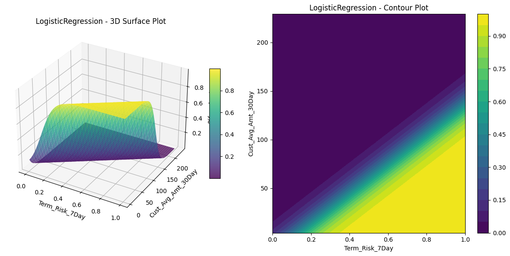
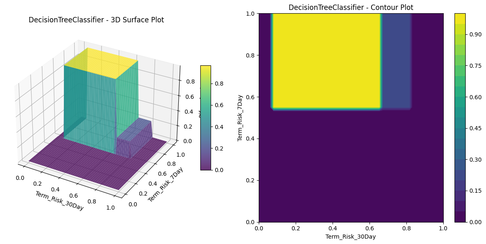
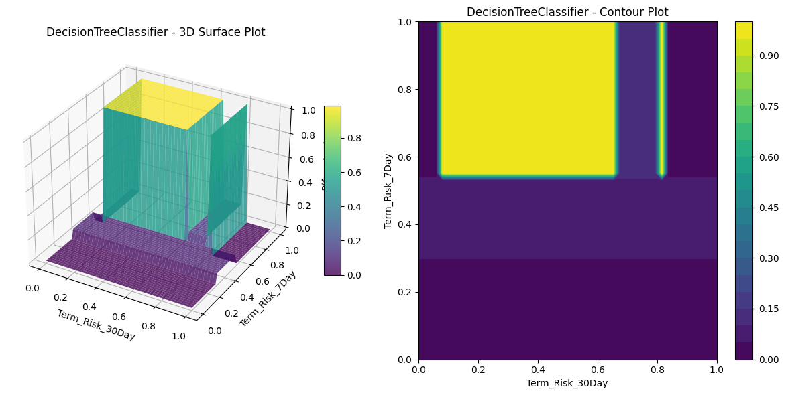
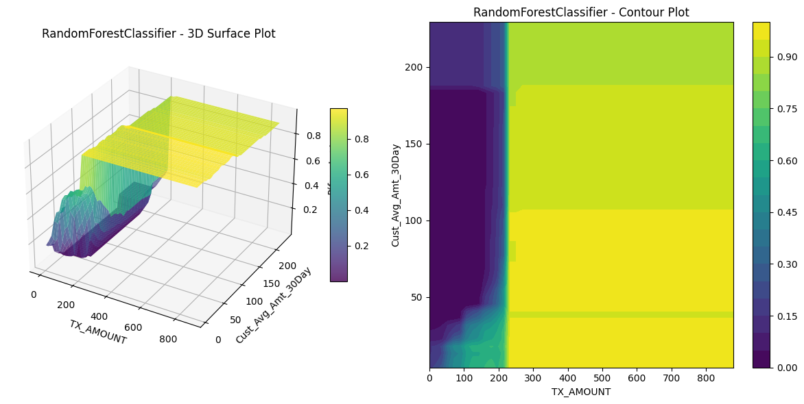
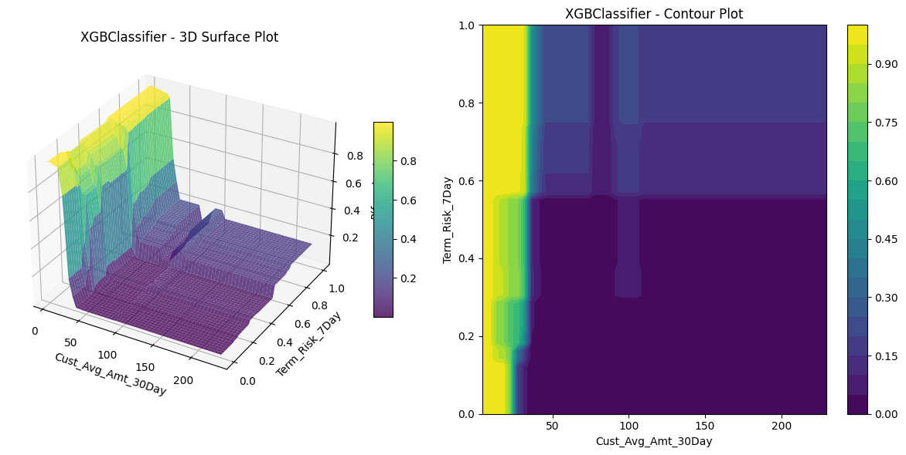
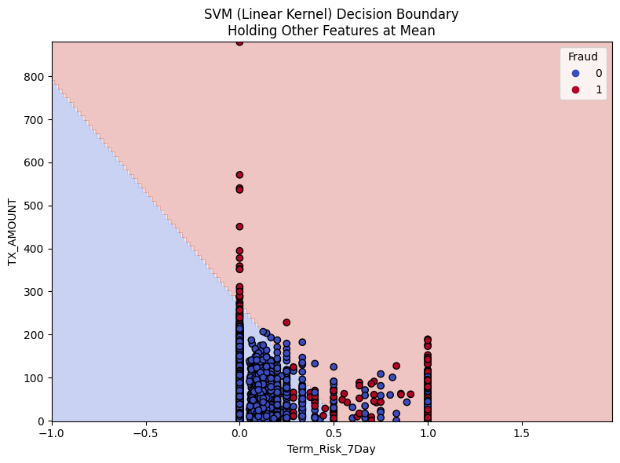
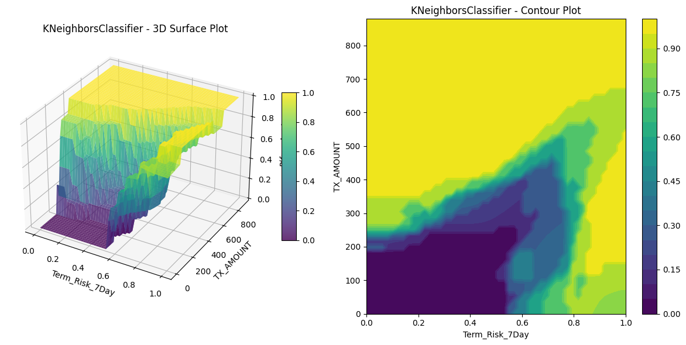
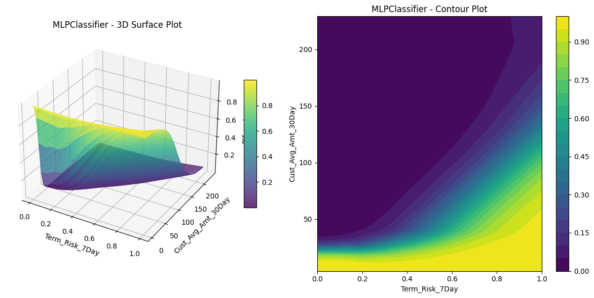

# 4. What do the models look like?

I fit each of our models to the fraud handbook data, using their choice of training dataset. I used the tuning process we described in the regulariztaion section of [Model formulas](2-model-formulas-250814.md). (Tune the model parameters on the training data using default hyperparameters. Tune the hyperparameters using stratified 5-fold cross validation - stratified becuase of the class imbalance. Re-tune the model parameters on the training data using the tuned hyperparameters.)

I modeled TX_FRAUD as a function of the features, omitting the redundant features TX_DATETIME, TX_TIME_SECONDS, and TX_TIME_DAYS (as well as the Id variables and TX_FRAUD_SCENARIO).  

## An aside on the Handbook's trainign and test data

The Handbook states that in such a scenario, the training data often consists of one set of consecutive days, followed by a gap (“delay”) period, followed by another set of consecutive days for the test data. As noted earlier, the Handbook makes the simplifying assumption that fraud is detected exactly seven days after it occurs.  So, a transaction made on 4/1/18 labeled as fraud or legit isn’t known to be fraud or legit until 4/8/18. 

To be consistent with the Handbook, we will use the same training and test data that they did.  Namely, the train_df consists of all tx for the week beginning 7/25/18.  The test_df consists of a subset of transactions for the week beginning 8/8/18, where they drop all transactions from cards that were previously identified as having a fraudulent transaction during a specific period of time. This period includes the entire training window and a portion of the test window.  

I have a couple of minor quibbles with, or at least questions about, the Handbook’s choices here:

•	I don’t understand inserting a time buffer between the train and test data.
•	I don’t understand the decision to exclude compromised cards from the test data.

### On the buffer between train and test

The Handbook seems to say this is necessitated by the delay in knowing whether a transaction is legit or not.  From the standpoint of simply knowing that all of your training and test data are correctly labelled, the one-week delay in knowledge of whether a tx in fraud would seem to me just to require that the training and test windows both occur at least a week prior to when you are training and testing your models. It wouldn’t seem to me to require a buffer between train and test.

That said, I think that you might want a buffer to ensure that the features involving look-back windows (1, 7, 30-day windows for customers and terminals) in the test data are completely free of influence from the training dataset.  But that would seem to require a longer buffer (like 30 days).

### On excluding compromised cards from the test data

I think the decision of whether or not to include transactions in the test data from compromised cards might depend on your objective.  Including them can risk a model simply “memorizing” that a certain card is more likely to be fraudulent, even if you don’t (as you wouldn’t) include customer_id in your models. Such memorization could come about from engineered features that essentially reflect (thus leak information about) the card’s fraud history, like (# of fraud transactions for this card in train_df)/(#transactions for this card in train_df). But our engineered features related to the customer are the numbers of transactions and transaction amounts in the previous 1, 7, and 30-day windows.  They have nothing to do with fraud, so our engineered features don’t risk such leakage.

You might want to drop them simply to reflect that there will be new cards with no fraud history.  Conversely, you might want to keep them to reflect that most future txs will happen on cards for which you have a history of transactions (fraudulent or not).  

Another reason you might want to keep them is that dropping them would result in a test set with more cards with no fraud history.  This could lead you to underestimate both P(actual fraud | predicted fraud), i.e. precision, and P(predict fraud | actual fraud), i.e., recall.

But, like I said, I’m going to keep my test_df the same as in the Handbook.

### Back to plotting

To be able to plot anything, I chose the top two features for each model, using permutation feature importance and fixed the values for other features at their means.  I plotted a 3D plot of $P(y=1 \mid \mathbf{x})$ and the corresponding 2D contour plot. Let's compare them to our understanding from the equations for $P(y=1 \mid \mathbf{x})$. (So here, only the two most "important" features in $\mathbf{x}$ are varying.)

<details>
<summary>Click to expand/hide Python code</summary>

<pre> ```python
""" Setting things up """

import pandas as pd
import numpy as np
import datetime

path = "fraud_data_full.parquet"

df = pd.read_parquet(path, engine="pyarrow")
df.head()
df.info()

BEGIN_DATE = "2018-07-25"
END_DATE = "2018-08-14"
END_DATE = pd.to_datetime(END_DATE)
adjusted_end_date = END_DATE + pd.Timedelta(days=1) - pd.Timedelta(microseconds=1)
transactions_df = df[(df['TX_DATETIME'] >= BEGIN_DATE) & (df['TX_DATETIME'] <= adjusted_end_date)].reset_index(drop=True)

print(transactions_df.shape)
first_day = transactions_df['TX_DATETIME'].min().date()
last_day = transactions_df['TX_DATETIME'].max().date()

output_feature="TX_FRAUD"

input_features=['TX_AMOUNT','TX_DURING_WEEKEND', 'TX_DURING_NIGHT', 'CUSTOMER_ID_NB_TX_1DAY_WINDOW',
       'CUSTOMER_ID_AVG_AMOUNT_1DAY_WINDOW', 'CUSTOMER_ID_NB_TX_7DAY_WINDOW',
       'CUSTOMER_ID_AVG_AMOUNT_7DAY_WINDOW', 'CUSTOMER_ID_NB_TX_30DAY_WINDOW',
       'CUSTOMER_ID_AVG_AMOUNT_30DAY_WINDOW', 'TERMINAL_ID_NB_TX_1DAY_WINDOW',
       'TERMINAL_ID_RISK_1DAY_WINDOW', 'TERMINAL_ID_NB_TX_7DAY_WINDOW',
       'TERMINAL_ID_RISK_7DAY_WINDOW', 'TERMINAL_ID_NB_TX_30DAY_WINDOW',
       'TERMINAL_ID_RISK_30DAY_WINDOW']

""" Shortening feature names """

# 1. Define your renaming map
rename_map = {}
for window in [1, 7, 30]:
    rename_map[f'CUSTOMER_ID_NB_TX_{window}DAY_WINDOW']       = f'Cust_Nb_Tx_{window}Day'
    rename_map[f'CUSTOMER_ID_AVG_AMOUNT_{window}DAY_WINDOW'] = f'Cust_Avg_Amt_{window}Day'
    rename_map[f'TERMINAL_ID_NB_TX_{window}DAY_WINDOW']      = f'Term_Nb_Tx_{window}Day'
    rename_map[f'TERMINAL_ID_RISK_{window}DAY_WINDOW']       = f'Term_Risk_{window}Day'
print(rename_map)
    
# 2. Apply to your DataFrames (in place or by reassignment)
transactions_df.rename(columns=rename_map, inplace=True)
#train_df.rename(columns=rename_map, inplace=True)
#test_df.rename(columns=rename_map, inplace=True)

# 3. Update your input_features list as well
input_features = [
    rename_map.get(col, col)  # use new name if in map, else keep original
    for col in input_features
]

# 4. Verify
print("Renamed columns:", [c for c in transactions_df.columns if c in rename_map.values()])
print("Updated input_features:", input_features)

""" Define the training and test data """

# Training period
start_date_training = datetime.datetime.strptime("2018-07-25", "%Y-%m-%d")
delta_train = delta_delay = delta_test = 7

end_date_training = start_date_training+datetime.timedelta(days=delta_train-1)

# Test period
start_date_test = start_date_training+datetime.timedelta(days=delta_train+delta_delay)
end_date_test = start_date_training+datetime.timedelta(days=delta_train+delta_delay+delta_test-1)


def get_train_test_set(transactions_df,
                       start_date_training,
                       delta_train=7,delta_delay=7,delta_test=7):
    
    # Get the training set data
    train_df = transactions_df[(transactions_df.TX_DATETIME>=start_date_training) &
                               (transactions_df.TX_DATETIME<start_date_training+datetime.timedelta(days=delta_train))]
    
    # Get the test set data
    test_df = []
    
    # Note: Cards known to be compromised after the delay period are removed from the test set
    # That is, for each test day, all frauds known at (test_day-delay_period) are removed
    
    # First, get known defrauded customers from the training set
    known_defrauded_customers = set(train_df[train_df.TX_FRAUD==1].CUSTOMER_ID)
    
    # Get the relative starting day of training set (easier than TX_DATETIME to collect test data)
    start_tx_time_days_training = train_df.TX_TIME_DAYS.min()
    
    # Then, for each day of the test set
    for day in range(delta_test):
            
        # Get test data for that day
        test_df_day = transactions_df[transactions_df.TX_TIME_DAYS==start_tx_time_days_training+
                                                                    delta_train+delta_delay+
                                                                    day]
        
        # Compromised cards from that test day, minus the delay period, are added to the pool of known defrauded customers
        test_df_day_delay_period = transactions_df[transactions_df.TX_TIME_DAYS==start_tx_time_days_training+
                                                                                delta_train+
                                                                                day-1]
        
        new_defrauded_customers = set(test_df_day_delay_period[test_df_day_delay_period.TX_FRAUD==1].CUSTOMER_ID)
                
        known_defrauded_customers = known_defrauded_customers.union(new_defrauded_customers)
        
        test_df_day = test_df_day[~test_df_day.CUSTOMER_ID.isin(known_defrauded_customers)]
        
        test_df.append(test_df_day)
        
    test_df = pd.concat(test_df)
    
    # Sort data sets by ascending order of transaction ID
    train_df=train_df.sort_values('TRANSACTION_ID')
    test_df=test_df.sort_values('TRANSACTION_ID')
    
    return (train_df, test_df)

(train_df, test_df)=get_train_test_set(transactions_df,start_date_training, delta_train=7,delta_delay=7,delta_test=7)

""" Tuning the parameters and hyperparameters """

# 1. Imports and Definitions

import numpy as np
from sklearn.model_selection import StratifiedKFold, GridSearchCV
from sklearn.pipeline import Pipeline
from sklearn.compose import ColumnTransformer
from sklearn.preprocessing import StandardScaler
from sklearn.linear_model import LogisticRegression
from sklearn.tree import DecisionTreeClassifier
from sklearn.ensemble import RandomForestClassifier
from sklearn.svm import SVC
from sklearn.neighbors import KNeighborsClassifier
from sklearn.neural_network import MLPClassifier
from xgboost import XGBClassifier

# Target variable (labels)
y = train_df['TX_FRAUD']

# Drop identifiers such as transaction/customer/terminal IDs:
X = train_df[input_features]

# --- 2. Preprocessor: all features numeric ---
numeric_features = input_features

numeric_transformer = Pipeline(steps=[
    ('scaler', StandardScaler())
])

preprocessor = ColumnTransformer(
    transformers=[
        ('num', numeric_transformer, numeric_features)
    ],
    remainder='drop'  # Only keep numeric features
)
# Define classifiers
classifiers_dictionary = {
    'Logistic regression': LogisticRegression(random_state=0, penalty='l2', solver='lbfgs', max_iter=1000),
    'Decision tree (depth=2)': DecisionTreeClassifier(max_depth=2, random_state=0),
    'Decision tree (unlimited depth)': DecisionTreeClassifier(random_state=0),
    'Random forest': RandomForestClassifier(random_state=0, n_jobs=-1),
    'XGBoost': XGBClassifier(random_state=0, n_jobs=-1, use_label_encoder=False, eval_metric='logloss'),
    'SVM (linear kernel)': SVC(kernel='linear', probability=True, random_state=0),
    'k-Nearest Neighbors': KNeighborsClassifier(n_neighbors=5, n_jobs=-1),
    'Neural network (MLP)': MLPClassifier(hidden_layer_sizes=(100,), random_state=0)
}

# Models that require feature standardization
to_standardize = [
    'Logistic regression', 'SVM (linear kernel)', 'k-Nearest Neighbors', 'Neural network (MLP)'
]

# 2. Build Pipelines
pipelines = {}
for name, clf in classifiers_dictionary.items():
    if name in to_standardize:
        pipelines[name] = Pipeline(steps=[
            ('preprocessor', preprocessor),  # scaling
            ('clf', clf)
        ])
    else:
        # No scaler, just pass raw numeric features
        pipelines[name] = Pipeline(steps=[
            ('clf', clf)
        ])

# 3. Stratified 5-Fold Cross-validation
cv = StratifiedKFold(n_splits=5, shuffle=True, random_state=0)

""" Generating the 3D plots and contour plots """

# 4. Default Model Evaluation
from sklearn.metrics import log_loss

for name, pipe in pipelines.items():
    print(f"=== {name} ===")
    losses = []
    for train_idx, test_idx in cv.split(X, y):
        pipe.fit(X.iloc[train_idx], y.iloc[train_idx])
        y_pred_proba = pipe.predict_proba(X.iloc[test_idx])
        loss = log_loss(y.iloc[test_idx], y_pred_proba)  # log-loss
        losses.append(loss)
    print(f"Mean log-loss (default hyperparameters): {np.mean(losses):.4f}")

# 5. Hyperparameter Grids for Tuning
param_grids = {
    'Logistic regression': {'clf__C': [0.01, 0.1, 1, 10]},
    'Decision tree (depth=2)': {'clf__max_depth': [1, 2, 3]},
    'Decision tree (unlimited depth)': {'clf__max_depth': [None, 5, 10, 20]},
    'Random forest': {'clf__n_estimators': [50, 100], 'clf__max_depth': [None, 10, 20]},
    'XGBoost': {'clf__n_estimators': [50, 100], 'clf__max_depth': [3, 5, 7], 'clf__learning_rate': [0.01, 0.1, 0.2]},
    'SVM (linear kernel)': {'clf__C': [0.1, 1, 10], 'clf__gamma': ['scale', 'auto']},
    'k-Nearest Neighbors': {'clf__n_neighbors': [3, 5, 7], 'clf__weights': ['uniform', 'distance']},
    'Neural network (MLP)': {'clf__hidden_layer_sizes': [(50,), (100,), (100, 50)], 'clf__alpha': [0.0001, 0.001, 0.01]}
}

# 6. Hyperparameter Optimization with Cross-validation
optimized_pipelines = {}
for name, pipe in pipelines.items():
    print(f"--- Optimizing: {name} ---")
    grid_search = GridSearchCV(
        estimator=pipe,
        param_grid=param_grids[name],
        scoring='neg_log_loss',
        cv=cv,
        n_jobs=4,            # Adjust based on your CPU's logical cores (you have 12)
        verbose=1,            # Useful feedback, can be set to 0 to reduce output
        pre_dispatch='1.5*n_jobs',  # Controls how many jobs are dispatched to workers, can reduce memory spike
        error_score='raise'     # Make failure explicit; can be 'nan' if you prefer silent fail
    )
    grid_search.fit(X, y)
    print(f"Best params: {grid_search.best_params_}")
    print(f"Best mean log-loss: {-grid_search.best_score_:.4f}")
    # Save the best pipeline with optimal hyperparameters for later
    optimized_pipelines[name] = grid_search.best_estimator_

# 7. Re-estimate (Refit) Model Parameters with Best Hyperparameters
for name, best_pipe in optimized_pipelines.items():
    # Fit on the whole dataset (or, optionally, on a train set if you set aside a test set)
    best_pipe.fit(X, y)
    print(f"{name} pipeline refitted with best hyperparameters.")

""" Plot 3D and contour plots of P(fraud) against the two most important features in each model, holding other features constant at their means """

# Step 1: Extract Two Most Important Features per Classifier
from sklearn.inspection import permutation_importance

def get_top_two_features_permutation(pipeline, X_val, y_val, scoring='roc_auc', n_repeats=10, random_state=42):
    """
    Compute permutation importance for a fitted pipeline on validation data,
    and return the two features with the highest importance.
    """

    # Compute permutation importance on validation set
    result = permutation_importance(pipeline, X_val, y_val,
                                    n_repeats=n_repeats,
                                    random_state=random_state,
                                    scoring=scoring)

    importances = result.importances_mean

    # Handle feature names extraction:
    # If pipeline has a preprocessor step (like for scaled models), get feature names from it
    if 'preprocessor' in pipeline.named_steps:
        feature_names_prefixed = pipeline.named_steps['preprocessor'].get_feature_names_out()
        # Remove prefixes e.g., 'num__'
        feature_names = [name.split('__')[-1] for name in feature_names_prefixed]
    else:
        # For pipelines with no preprocessor (e.g., tree models without scaling), use original X columns
        feature_names = X_val.columns.tolist()

    # Pair features with importance and sort descending
    features_importance = sorted(zip(feature_names, importances), key=lambda x: x[1], reverse=True)

    # Return top two features; pad if less than two features (rare)
    top_features = features_importance[:2]
    if len(top_features) < 2:
        top_features += [(None, 0)] * (2 - len(top_features))

    return top_features

# Step 2: Plot 3D Surface and Contour Plot for Two Features

import matplotlib.pyplot as plt
from mpl_toolkits.mplot3d import Axes3D  # Required for 3d plotting, no direct usage needed

def plot_3d_surface_and_contour_permutation(pipeline, X, feature_pair, name="plot"):
    """
    Plot 3D surface and contour of predicted fraud probability vs two features,
    holding other features fixed at mean.
    """

    if feature_pair[0][0] is None or feature_pair[1][0] is None:
        print("Skipping plot: insufficient features in permutation importance.")
        return

    feature_1, imp_1 = feature_pair[0]
    feature_2, imp_2 = feature_pair[1]

    # Fix other features at their mean
    X_fixed = X.mean().copy()

    # Create grid of values for features 1 and 2
    f1_vals = np.linspace(X[feature_1].min(), X[feature_1].max(), 50)
    f2_vals = np.linspace(X[feature_2].min(), X[feature_2].max(), 50)
    F1_mesh, F2_mesh = np.meshgrid(f1_vals, f2_vals)

    # Prepare input for prediction
    X_plot = np.tile(X_fixed.values, (f1_vals.size * f2_vals.size, 1))

    # Get indices of the features in X.columns
    f1_idx = X.columns.get_loc(feature_1)
    f2_idx = X.columns.get_loc(feature_2)

    # Set grid values in input array
    X_plot[:, f1_idx] = F1_mesh.ravel()
    X_plot[:, f2_idx] = F2_mesh.ravel()

    # Convert to DataFrame for pipeline input
    X_plot_df = pd.DataFrame(X_plot, columns=X.columns)

    # Predict probabilities
    probabilities = pipeline.predict_proba(X_plot_df)[:, 1]

    # Reshape back to mesh shape
    Z = probabilities.reshape(F1_mesh.shape)

    # Plot 3D Surface Plot
    fig = plt.figure(figsize=(12, 6))

    ax = fig.add_subplot(121, projection='3d')
    surf = ax.plot_surface(F1_mesh, F2_mesh, Z, cmap='viridis', edgecolor='none', alpha=0.8)
    ax.set_xlabel(feature_1)
    ax.set_ylabel(feature_2)
    ax.set_zlabel('P(fraud=1)')
    ax.set_title(f'{pipeline.named_steps["clf"].__class__.__name__} - 3D Surface Plot')
    fig.colorbar(surf, ax=ax, shrink=0.5, aspect=10)

    # Plot Contour Plot
    ax2 = fig.add_subplot(122)
    contour = ax2.contourf(F1_mesh, F2_mesh, Z, cmap='viridis', levels=20)
    ax2.set_xlabel(feature_1)
    ax2.set_ylabel(feature_2)
    ax2.set_title(f'{pipeline.named_steps["clf"].__class__.__name__} - Contour Plot')
    fig.colorbar(contour, ax=ax2)

    plt.tight_layout()
    plt.savefig(f"{name}.png", bbox_inches='tight')
    plt.show()

# Step 3: Generate Table of Classifier - Features - Importance (Color-coded)
import matplotlib.colors as mcolors

def generate_importance_table_permutation(optimized_pipelines, X_val, y_val):
    """
    Generate a pandas Styler table with classifier names, top two features by permutation importance,
    and color-coded importance scores.
    """

    rows = []
    for name, pipeline in optimized_pipelines.items():
        top_features = get_top_two_features_permutation(pipeline, X_val, y_val)
        if top_features is None:
            feat1, imp1 = ('N/A', 0)
            feat2, imp2 = ('N/A', 0)
        else:
            (feat1, imp1), (feat2, imp2) = top_features
        rows.append({
            'Classifier': name,
            'Feature 1': feat1,
            'Importance 1': imp1,
            'Feature 2': feat2,
            'Importance 2': imp2
        })

    df_table = pd.DataFrame(rows)

    # Normalize importance for colormap: 0 to max importance
    max_imp = df_table[['Importance 1', 'Importance 2']].values.max()
    norm = mcolors.Normalize(vmin=0, vmax=max_imp)
    cmap = plt.cm.coolwarm

    def highlight_importance(val):
        if val == 0 or pd.isna(val):
            return ''
        rgba = cmap(norm(val))
        hex_color = '#{:02x}{:02x}{:02x}'.format(int(rgba[0]*255), int(rgba[1]*255), int(rgba[2]*255))
        return f'background-color: {hex_color}'

    styled_df = df_table.style.applymap(highlight_importance, subset=['Importance 1', 'Importance 2'])

    return styled_df

# Step 4: Run and Display Everything Together

# I'm using the test set for validation. 

X_val, y_val = test_df[input_features], test_df['TX_FRAUD']

for name, pipeline in optimized_pipelines.items():
    print(f"Classifier: {name}")
    top_feats = get_top_two_features_permutation(pipeline, X_val, y_val)
    if top_feats is None or top_feats[0][0] is None:
        print(f"Skipping plot for {name}: permutation importance not available.")
        continue
    print(f"Top 2 features by permutation importance: {top_feats[0][0]} ({top_feats[0][1]:.3f}), {top_feats[1][0]} ({top_feats[1][1]:.3f})")
    plot_3d_surface_and_contour_permutation(pipeline, X_val, top_feats, name)

# Display importance table
importance_table = generate_importance_table_permutation(optimized_pipelines, X_val, y_val)
importance_table  # If in Jupyter, this renders nicely

import dataframe_image as dfi

# Assuming styled_df is the styled pandas DataFrame you created with color coding
dfi.export(styled_df, "importance_table.png")

""" Print the numbers of parameters and hyperparameters for each model """

# print number of parameters and hyperparameters for each classifier:
def count_model_parameters(model):
    """Estimate number of parameters in a scikit-learn model"""
    # Logistic Regression, Linear SVM have coef_ and intercept_
    if hasattr(model, 'coef_') and hasattr(model, 'intercept_'):
        num_params = model.coef_.size + model.intercept_.size
        return num_params
    
    # Tree-based models: sum of number of nodes (can proxy parameters)
    elif hasattr(model, 'tree_'):
        # Number of nodes as proxy
        return model.tree_.node_count
    
    # Random Forest, Gradient Boosting, XGBoost Model
    elif hasattr(model, 'estimators_'):
        # Sum parameters of all trees
        total = 0
        for est in model.estimators_:
            if hasattr(est, 'tree_'):
                total += est.tree_.node_count
        return total
    
    # MLP Neural Network
    elif hasattr(model, 'coefs_') and hasattr(model, 'intercepts_'):
        total = sum(coef.size for coef in model.coefs_) + sum(inter.size for inter in model.intercepts_)
        return total
    
    # SVMs
    elif hasattr(model, 'support_vectors_'):
        # Number of support vectors times feature dimension as proxy
        num_sv = model.support_vectors_.shape[0]
        dim = model.support_vectors_.shape[1]
        # Also include dual coefficients count and intercept
        num_params = num_sv * dim + model.dual_coef_.size + len(model.intercept_)
        return num_params
    
    else:
        # Fallback: try to sum numpy array attributes size heuristically
        total = 0
        for attr in dir(model):
            try:
                val = getattr(model, attr)
                if hasattr(val, 'shape'):
                    total += val.size
            except Exception:
                pass
        return total if total > 0 else None

# Main loop for printing
for name, pipeline in optimized_pipelines.items():
    print(f"Classifier: {name}")
    clf = pipeline.named_steps['clf']

    # Count model parameters
    n_params = count_model_parameters(clf)
    print(f"Number of model parameters (approx.): {n_params}")

    # Get hyperparameters
    hyperparams = clf.get_params()
    print("Hyperparameters:")
    for param_name, param_value in hyperparams.items():
        print(f"  {param_name}: {param_value}")
    print("-" * 50)


``` </pre>
</details>

## 4.1 Logistic regression

$\textbf{Model form}$: $$P(y=1 \ | \ \mathbf{x}\in\mathcal{X}) = \sigma(\mathbf{w}^t \mathbf{x} + b) = \frac{1}{1 + \exp(-\sum_{i=1}^n w_i x_i  - b)}$$
 where $b, w_1,..., w_m \in \mathbb{R}$ are the model parameters. 

We expect the model to be a sigmoid surface, which is exactly what it looks like:



## 4.2 Decision trees

$\textbf{Model form}$: $$P(y=1 \mid \mathbf{x}\in\mathcal{X}) = \sum_{t=1}^T r_t \ \mathbb{I}(\mathbf{x}\in L_t)$$ where $\mathbb{I}(.)$ is the boolean indicator function (taking the value 1 if its argument is true and 0 otherwise), the leaves $L_1,... L_T$ are rectanguloids partitioning the feature space, and the "leaf weights" $r_1,..., r_T$ are the class-weighted fraud incidences on the leaves: $$r_t:= \frac{\sum_{i\in L_t} s_i y_i}{\sum_{i\in L_t} s_i}, \forall 1\leq t\leq T$$  

We expect this model to look like a bunch of steps on rectanguloids parallel to the axes, which is exactly what it looks like:





## 4.3 Random forests

$\textbf{Model form}$: $$P(y=1 \mid \mathbf{x}\in\mathcal{X}) = \frac{1}{K} \sum_{k=1}^K P_k (y=1 \mid \mathbf{x})$$ where $P_k (y=1 \mid \mathbf{x})$ is the prediction from a decision tree $T_k$ trained on a bootstrap sample of size $|\mathcal{D}|$ from the data $\mathcal{D}$ and from a simple random sample of 
$F$ features, for some $F\geq 1$. (The same value of $F$ is used for each tree.)

So the random forest predicts the chance of fraud given $\mathbf{x}\in\mathcal{X}$ to be the average of the class-weighted fraud incidence in the 
$K$ leaves to which $\mathbf{x}$ belongs. If I'm thinking right, I would also expect this model to look like a bunch of steps on rectanguloids parallel to the axes, just a busier version.  Using 100 trees in the forest, each point is on 100 leaves, each of which is a rectanguloid and intersecting rectanguloids gives rise to smaller rectanguloids.



## 4.4 Gradient boosted trees

$\textbf{Model form}$: 
$$P(y=1 \mid \mathbf{x}\in\mathcal{X}) = \sigma(b+\eta \sum_{k=1}^K f_k(\mathbf{x})) = \frac{1}{1+ \exp(-b-\eta \sum_{k=1}^K f_k(\mathbf{x}))}$$ where $b$ is the log-odds of the fraud rate in 
$\mathcal{D}$, $0<\eta<1$ is a hyperparameter (the "learning rate"), $K\geq 1$, and $f_1(\mathbf{x}),..., f_K(\mathbf{x})$ are the predictions from decision trees determined by the boosting algorithm.  

It's hard to imagine what a gradient boosted tree would look like.  We're taking a linear combination of trees that predict log-odds. Maybe this is part of the reason why they work so well in so many situations.



## 4.5 Support vector machines

$\textbf{Model form}$: Given a kernel $K:\mathbb{R}^m \times \mathbb{R}^m\rightarrow \mathbb{R}$, $$P(y=1 \mid \mathbf{x}\in\mathcal{X}) = \sigma \left( A \left( \sum_{i=1}^n w_i (2y_i - 1) K(\mathbf{X}_i, \mathbf{x})+b \right) + B \right)$$

I used the a linear kernel because this had the highest cross-validation AUC on the training data:

<details>
<summary>Click to expand/hide Python code</summary>
<pre> ```python
X = train_df[input_features]
y = train_df['TX_FRAUD']

from sklearn.svm import SVC
from sklearn.model_selection import cross_val_score
import numpy as np

# List of kernels to compare
kernels = ['linear', 'poly', 'rbf', 'sigmoid']

# Dictionary to store mean cross-validation scores
kernel_scores = {}

# Using 5-fold cross-validation as example
cv_folds = 5

# cross_val_score with an integer value for cv (like cv=5) uses stratified k-fold
for kernel in kernels:
    svm_clf = SVC(kernel=kernel, probability=True)  # Use default hyperparams
    scores = cross_val_score(svm_clf, X, y, cv=cv_folds, scoring='roc_auc')  # Using AUC for fraud detection
    mean_score = np.mean(scores)
    kernel_scores[kernel] = mean_score
    print(f"Kernel: {kernel}, Mean CV AUC: {mean_score:.4f}")

# Find best kernel by highest mean CV AUC
best_kernel = max(kernel_scores, key=kernel_scores.get)
print(f"\nBest kernel by CV AUC: {best_kernel} with score {kernel_scores[best_kernel]:.4f}")
``` </pre>
</details>

```text

Kernel: linear, Mean CV AUC: 0.8854
Kernel: poly, Mean CV AUC: 0.7892
Kernel: rbf, Mean CV AUC: 0.7849
Kernel: sigmoid, Mean CV AUC: 0.3789

Best kernel by CV AUC: linear with score 0.8854
```
With a linear kernel, $\sum_{i=1}^n w_i (2y_i - 1) K(\mathbf{X}_i, \mathbf{x})+b$ is just a linear combination of the entries of $\mathbf{x}$.  So, the decision boundary is a hyperplane, and like logistic regression, the probability surface looks like a sigmoid surface.




## 4.6 K-nearest neighbors

$\textbf{Model form}$: Given $k\geq 1$, estimate  $$P(y=1 \mid \mathbf{x}\in\mathcal{X}) = \frac{\sum_{i\in N_k(\mathbf{x})} s_i y_i}{\sum_{i\in N_k(\mathbf{x})} s_i}$$ where $N_k(\mathbf{x})$ is the set of indices of the $k$ samples in $\mathcal{D}$ with the $k$ smallest values of $||\mathbf{X}_i - \mathbf{x}||$. 

We expect this to look like a smoothed version of the raw fraud surface, kind of akin to taking moving averages in a time series.



## 4.7 Neural networks

$\textbf{Model form}$: Given $L\geq 1$,
$$P(y=1 \mid \mathbf{x}\in\mathcal{X}) = \sigma(W_L a_{L-1} + b_L)$$ 
where $a_0:=\mathbf{x}$ and for each 
$1\leq k\leq L-1$, $a_k:=ReLU(W_k a_{k-1} + b_k)$. So the model parameters are the $m\times m$ matrices $W_k$ and the vectors $b_k\in\mathbb{R}^m$.

There's a reason they call neural networks a black-box model.  I can't imagine a general pattern to what neural network models look like.  I am surpised by how smooth the result is.



The above plots were plotted against the top two features for each model (in terms of permutation importance).  With the exception of decision trees, the top two features were always among the following three: the charged amount, the average amount the cardholder charged in the past 30 days, and the share of transactions at the terminal 8-15 days ago that were fraudulent. 

<style type="text/css">
#T_bc5a5 th {
  font-size: 12pt;
  text-align: center;
  background-color: #f0f0f0;
}
#T_bc5a5_row0_col1, #T_bc5a5_row0_col4, #T_bc5a5_row0_col5, #T_bc5a5_row0_col6, #T_bc5a5_row0_col8, #T_bc5a5_row0_col9, #T_bc5a5_row0_col10, #T_bc5a5_row0_col11, #T_bc5a5_row2_col2, #T_bc5a5_row2_col10, #T_bc5a5_row3_col5, #T_bc5a5_row3_col6, #T_bc5a5_row3_col8, #T_bc5a5_row3_col9, #T_bc5a5_row3_col10, #T_bc5a5_row3_col11, #T_bc5a5_row3_col12, #T_bc5a5_row3_col14, #T_bc5a5_row4_col4, #T_bc5a5_row4_col5, #T_bc5a5_row4_col8, #T_bc5a5_row4_col9, #T_bc5a5_row4_col10, #T_bc5a5_row4_col11, #T_bc5a5_row4_col12, #T_bc5a5_row4_col14, #T_bc5a5_row5_col1, #T_bc5a5_row5_col4, #T_bc5a5_row5_col5, #T_bc5a5_row5_col6, #T_bc5a5_row5_col8, #T_bc5a5_row5_col9, #T_bc5a5_row5_col10, #T_bc5a5_row5_col11, #T_bc5a5_row6_col2, #T_bc5a5_row6_col3, #T_bc5a5_row6_col6, #T_bc5a5_row6_col8, #T_bc5a5_row6_col9, #T_bc5a5_row6_col12, #T_bc5a5_row7_col4, #T_bc5a5_row7_col5, #T_bc5a5_row7_col6, #T_bc5a5_row7_col8, #T_bc5a5_row7_col9, #T_bc5a5_row7_col10, #T_bc5a5_row7_col11 {
  background-color: #f7fbff;
  color: black;
}
#T_bc5a5_row0_col2, #T_bc5a5_row5_col2 {
  background-color: #d4e4f3;
  color: black;
}
#T_bc5a5_row0_col3 {
  background-color: #e7f0f9;
  color: black;
}
#T_bc5a5_row0_col7 {
  background-color: #d8e7f5;
  color: black;
}
#T_bc5a5_row0_col12, #T_bc5a5_row2_col3 {
  background-color: #f3f8fd;
  color: black;
}
#T_bc5a5_row0_col13, #T_bc5a5_row7_col14 {
  background-color: #f5f9fe;
  color: black;
}
#T_bc5a5_row0_col14, #T_bc5a5_row3_col4, #T_bc5a5_row4_col1, #T_bc5a5_row4_col6, #T_bc5a5_row5_col13, #T_bc5a5_row5_col14, #T_bc5a5_row6_col4, #T_bc5a5_row6_col5, #T_bc5a5_row6_col10, #T_bc5a5_row6_col11, #T_bc5a5_row6_col14 {
  background-color: #f6fafe;
  color: black;
}
#T_bc5a5_row0_col15 {
  background-color: #084083;
  color: white;
}
#T_bc5a5_row1_col1, #T_bc5a5_row1_col2, #T_bc5a5_row1_col3, #T_bc5a5_row1_col4, #T_bc5a5_row1_col5, #T_bc5a5_row1_col6, #T_bc5a5_row1_col8, #T_bc5a5_row1_col9, #T_bc5a5_row1_col10, #T_bc5a5_row1_col11, #T_bc5a5_row1_col12, #T_bc5a5_row2_col1, #T_bc5a5_row2_col4, #T_bc5a5_row2_col5, #T_bc5a5_row2_col6, #T_bc5a5_row2_col8, #T_bc5a5_row2_col9, #T_bc5a5_row2_col12 {
  color: black;
}
#T_bc5a5_row1_col7 {
  background-color: #dce9f6;
  color: black;
}
#T_bc5a5_row1_col13, #T_bc5a5_row7_col3 {
  background-color: #e9f2fa;
  color: black;
}
#T_bc5a5_row1_col14, #T_bc5a5_row2_col14 {
  background-color: #09539d;
  color: white;
}
#T_bc5a5_row1_col15, #T_bc5a5_row7_col7 {
  background-color: #d6e5f4;
  color: black;
}
#T_bc5a5_row2_col7, #T_bc5a5_row5_col3 {
  background-color: #e4eef8;
  color: black;
}
#T_bc5a5_row2_col11, #T_bc5a5_row4_col3, #T_bc5a5_row6_col1 {
  background-color: #f1f7fd;
  color: black;
}
#T_bc5a5_row2_col13, #T_bc5a5_row5_col12 {
  background-color: #f0f6fc;
  color: black;
}
#T_bc5a5_row2_col15, #T_bc5a5_row4_col15, #T_bc5a5_row5_col7 {
  background-color: #d1e2f2;
  color: black;
}
#T_bc5a5_row3_col1, #T_bc5a5_row3_col15 {
  background-color: #eef5fc;
  color: black;
}
#T_bc5a5_row3_col2 {
  background-color: #e1ecf7;
  color: black;
}
#T_bc5a5_row3_col3 {
  background-color: #eff6fc;
  color: black;
}
#T_bc5a5_row3_col7 {
  background-color: #ddeaf6;
  color: black;
}
#T_bc5a5_row3_col13 {
  background-color: #eff5fc;
  color: black;
}
#T_bc5a5_row4_col2 {
  background-color: #cbdef0;
  color: black;
}
#T_bc5a5_row4_col7 {
  background-color: #dae8f5;
  color: black;
}
#T_bc5a5_row4_col13, #T_bc5a5_row7_col12, #T_bc5a5_row7_col13 {
  background-color: #f4f9fe;
  color: black;
}
#T_bc5a5_row5_col15 {
  background-color: #08306b;
  color: white;
}
#T_bc5a5_row6_col7 {
  background-color: #e4eff9;
  color: black;
}
#T_bc5a5_row6_col13, #T_bc5a5_row7_col1 {
  background-color: #f2f7fd;
  color: black;
}
#T_bc5a5_row6_col15 {
  background-color: #b1d2e7;
  color: black;
}
#T_bc5a5_row7_col2 {
  background-color: #cddff1;
  color: black;
}
#T_bc5a5_row7_col15 {
  background-color: #084991;
  color: white;
}
</style>
<table id="T_bc5a5">
  <thead>
    <tr>
      <th class="blank level0" >&nbsp;</th>
      <th id="T_bc5a5_level0_col0" class="col_heading level0 col0" >Classifier</th>
      <th id="T_bc5a5_level0_col1" class="col_heading level0 col1" >Cust_Avg_Amt_1Day</th>
      <th id="T_bc5a5_level0_col2" class="col_heading level0 col2" >Cust_Avg_Amt_30Day</th>
      <th id="T_bc5a5_level0_col3" class="col_heading level0 col3" >Cust_Avg_Amt_7Day</th>
      <th id="T_bc5a5_level0_col4" class="col_heading level0 col4" >Cust_Nb_Tx_1Day</th>
      <th id="T_bc5a5_level0_col5" class="col_heading level0 col5" >Cust_Nb_Tx_30Day</th>
      <th id="T_bc5a5_level0_col6" class="col_heading level0 col6" >Cust_Nb_Tx_7Day</th>
      <th id="T_bc5a5_level0_col7" class="col_heading level0 col7" >TX_AMOUNT</th>
      <th id="T_bc5a5_level0_col8" class="col_heading level0 col8" >TX_DURING_NIGHT</th>
      <th id="T_bc5a5_level0_col9" class="col_heading level0 col9" >TX_DURING_WEEKEND</th>
      <th id="T_bc5a5_level0_col10" class="col_heading level0 col10" >Term_Nb_Tx_1Day</th>
      <th id="T_bc5a5_level0_col11" class="col_heading level0 col11" >Term_Nb_Tx_30Day</th>
      <th id="T_bc5a5_level0_col12" class="col_heading level0 col12" >Term_Nb_Tx_7Day</th>
      <th id="T_bc5a5_level0_col13" class="col_heading level0 col13" >Term_Risk_1Day</th>
      <th id="T_bc5a5_level0_col14" class="col_heading level0 col14" >Term_Risk_30Day</th>
      <th id="T_bc5a5_level0_col15" class="col_heading level0 col15" >Term_Risk_7Day</th>
    </tr>
  </thead>
  <tbody>
    <tr>
      <th id="T_bc5a5_level0_row0" class="row_heading level0 row0" >0</th>
      <td id="T_bc5a5_row0_col0" class="data row0 col0" >Logistic regression</td>
      <td id="T_bc5a5_row0_col1" class="data row0 col1" >-0.000413</td>
      <td id="T_bc5a5_row0_col2" class="data row0 col2" >0.081851</td>
      <td id="T_bc5a5_row0_col3" class="data row0 col3" >0.036345</td>
      <td id="T_bc5a5_row0_col4" class="data row0 col4" >-0.000066</td>
      <td id="T_bc5a5_row0_col5" class="data row0 col5" >-0.000191</td>
      <td id="T_bc5a5_row0_col6" class="data row0 col6" >0.000775</td>
      <td id="T_bc5a5_row0_col7" class="data row0 col7" >0.071667</td>
      <td id="T_bc5a5_row0_col8" class="data row0 col8" >0.000001</td>
      <td id="T_bc5a5_row0_col9" class="data row0 col9" >-0.000076</td>
      <td id="T_bc5a5_row0_col10" class="data row0 col10" >-0.000103</td>
      <td id="T_bc5a5_row0_col11" class="data row0 col11" >-0.001281</td>
      <td id="T_bc5a5_row0_col12" class="data row0 col12" >0.010516</td>
      <td id="T_bc5a5_row0_col13" class="data row0 col13" >0.003888</td>
      <td id="T_bc5a5_row0_col14" class="data row0 col14" >0.002501</td>
      <td id="T_bc5a5_row0_col15" class="data row0 col15" >0.430211</td>
    </tr>
    <tr>
      <th id="T_bc5a5_level0_row1" class="row_heading level0 row1" >1</th>
      <td id="T_bc5a5_row1_col0" class="data row1 col0" >Decision tree (depth=2)</td>
      <td id="T_bc5a5_row1_col1" class="data row1 col1" >0.000000</td>
      <td id="T_bc5a5_row1_col2" class="data row1 col2" >0.000000</td>
      <td id="T_bc5a5_row1_col3" class="data row1 col3" >0.000000</td>
      <td id="T_bc5a5_row1_col4" class="data row1 col4" >0.000000</td>
      <td id="T_bc5a5_row1_col5" class="data row1 col5" >0.000000</td>
      <td id="T_bc5a5_row1_col6" class="data row1 col6" >0.000000</td>
      <td id="T_bc5a5_row1_col7" class="data row1 col7" >0.061397</td>
      <td id="T_bc5a5_row1_col8" class="data row1 col8" >0.000000</td>
      <td id="T_bc5a5_row1_col9" class="data row1 col9" >0.000000</td>
      <td id="T_bc5a5_row1_col10" class="data row1 col10" >0.000000</td>
      <td id="T_bc5a5_row1_col11" class="data row1 col11" >0.000000</td>
      <td id="T_bc5a5_row1_col12" class="data row1 col12" >0.000000</td>
      <td id="T_bc5a5_row1_col13" class="data row1 col13" >0.030592</td>
      <td id="T_bc5a5_row1_col14" class="data row1 col14" >0.397658</td>
      <td id="T_bc5a5_row1_col15" class="data row1 col15" >0.075938</td>
    </tr>
    <tr>
      <th id="T_bc5a5_level0_row2" class="row_heading level0 row2" >2</th>
      <td id="T_bc5a5_row2_col0" class="data row2 col0" >Decision tree (unlimited depth)</td>
      <td id="T_bc5a5_row2_col1" class="data row2 col1" >0.000000</td>
      <td id="T_bc5a5_row2_col2" class="data row2 col2" >0.000531</td>
      <td id="T_bc5a5_row2_col3" class="data row2 col3" >0.007967</td>
      <td id="T_bc5a5_row2_col4" class="data row2 col4" >0.000000</td>
      <td id="T_bc5a5_row2_col5" class="data row2 col5" >0.000000</td>
      <td id="T_bc5a5_row2_col6" class="data row2 col6" >0.000000</td>
      <td id="T_bc5a5_row2_col7" class="data row2 col7" >0.043456</td>
      <td id="T_bc5a5_row2_col8" class="data row2 col8" >0.000000</td>
      <td id="T_bc5a5_row2_col9" class="data row2 col9" >0.000000</td>
      <td id="T_bc5a5_row2_col10" class="data row2 col10" >0.000144</td>
      <td id="T_bc5a5_row2_col11" class="data row2 col11" >0.013498</td>
      <td id="T_bc5a5_row2_col12" class="data row2 col12" >0.000000</td>
      <td id="T_bc5a5_row2_col13" class="data row2 col13" >0.014664</td>
      <td id="T_bc5a5_row2_col14" class="data row2 col14" >0.397651</td>
      <td id="T_bc5a5_row2_col15" class="data row2 col15" >0.087451</td>
    </tr>
    <tr>
      <th id="T_bc5a5_level0_row3" class="row_heading level0 row3" >3</th>
      <td id="T_bc5a5_row3_col0" class="data row3 col0" >Random forest</td>
      <td id="T_bc5a5_row3_col1" class="data row3 col1" >0.020873</td>
      <td id="T_bc5a5_row3_col2" class="data row3 col2" >0.051378</td>
      <td id="T_bc5a5_row3_col3" class="data row3 col3" >0.017325</td>
      <td id="T_bc5a5_row3_col4" class="data row3 col4" >0.003546</td>
      <td id="T_bc5a5_row3_col5" class="data row3 col5" >-0.000989</td>
      <td id="T_bc5a5_row3_col6" class="data row3 col6" >-0.001976</td>
      <td id="T_bc5a5_row3_col7" class="data row3 col7" >0.059775</td>
      <td id="T_bc5a5_row3_col8" class="data row3 col8" >-0.003557</td>
      <td id="T_bc5a5_row3_col9" class="data row3 col9" >-0.001675</td>
      <td id="T_bc5a5_row3_col10" class="data row3 col10" >-0.002747</td>
      <td id="T_bc5a5_row3_col11" class="data row3 col11" >-0.000534</td>
      <td id="T_bc5a5_row3_col12" class="data row3 col12" >-0.001875</td>
      <td id="T_bc5a5_row3_col13" class="data row3 col13" >0.018088</td>
      <td id="T_bc5a5_row3_col14" class="data row3 col14" >-0.002506</td>
      <td id="T_bc5a5_row3_col15" class="data row3 col15" >0.019964</td>
    </tr>
    <tr>
      <th id="T_bc5a5_level0_row4" class="row_heading level0 row4" >4</th>
      <td id="T_bc5a5_row4_col0" class="data row4 col0" >XGBoost</td>
      <td id="T_bc5a5_row4_col1" class="data row4 col1" >0.002739</td>
      <td id="T_bc5a5_row4_col2" class="data row4 col2" >0.100941</td>
      <td id="T_bc5a5_row4_col3" class="data row4 col3" >0.014282</td>
      <td id="T_bc5a5_row4_col4" class="data row4 col4" >-0.000605</td>
      <td id="T_bc5a5_row4_col5" class="data row4 col5" >-0.001845</td>
      <td id="T_bc5a5_row4_col6" class="data row4 col6" >0.003158</td>
      <td id="T_bc5a5_row4_col7" class="data row4 col7" >0.066594</td>
      <td id="T_bc5a5_row4_col8" class="data row4 col8" >-0.000347</td>
      <td id="T_bc5a5_row4_col9" class="data row4 col9" >-0.000432</td>
      <td id="T_bc5a5_row4_col10" class="data row4 col10" >0.000285</td>
      <td id="T_bc5a5_row4_col11" class="data row4 col11" >-0.004865</td>
      <td id="T_bc5a5_row4_col12" class="data row4 col12" >0.000749</td>
      <td id="T_bc5a5_row4_col13" class="data row4 col13" >0.006235</td>
      <td id="T_bc5a5_row4_col14" class="data row4 col14" >-0.000606</td>
      <td id="T_bc5a5_row4_col15" class="data row4 col15" >0.087972</td>
    </tr>
    <tr>
      <th id="T_bc5a5_level0_row5" class="row_heading level0 row5" >5</th>
      <td id="T_bc5a5_row5_col0" class="data row5 col0" >SVM (linear kernel)</td>
      <td id="T_bc5a5_row5_col1" class="data row5 col1" >0.001095</td>
      <td id="T_bc5a5_row5_col2" class="data row5 col2" >0.079414</td>
      <td id="T_bc5a5_row5_col3" class="data row5 col3" >0.044138</td>
      <td id="T_bc5a5_row5_col4" class="data row5 col4" >-0.000215</td>
      <td id="T_bc5a5_row5_col5" class="data row5 col5" >-0.000506</td>
      <td id="T_bc5a5_row5_col6" class="data row5 col6" >0.000120</td>
      <td id="T_bc5a5_row5_col7" class="data row5 col7" >0.089455</td>
      <td id="T_bc5a5_row5_col8" class="data row5 col8" >-0.000157</td>
      <td id="T_bc5a5_row5_col9" class="data row5 col9" >-0.000157</td>
      <td id="T_bc5a5_row5_col10" class="data row5 col10" >0.000088</td>
      <td id="T_bc5a5_row5_col11" class="data row5 col11" >-0.000186</td>
      <td id="T_bc5a5_row5_col12" class="data row5 col12" >0.014835</td>
      <td id="T_bc5a5_row5_col13" class="data row5 col13" >0.002428</td>
      <td id="T_bc5a5_row5_col14" class="data row5 col14" >0.002547</td>
      <td id="T_bc5a5_row5_col15" class="data row5 col15" >0.459101</td>
    </tr>
    <tr>
      <th id="T_bc5a5_level0_row6" class="row_heading level0 row6" >6</th>
      <td id="T_bc5a5_row6_col0" class="data row6 col0" >k-Nearest Neighbors</td>
      <td id="T_bc5a5_row6_col1" class="data row6 col1" >0.013140</td>
      <td id="T_bc5a5_row6_col2" class="data row6 col2" >-0.002653</td>
      <td id="T_bc5a5_row6_col3" class="data row6 col3" >-0.001818</td>
      <td id="T_bc5a5_row6_col4" class="data row6 col4" >0.002284</td>
      <td id="T_bc5a5_row6_col5" class="data row6 col5" >0.002526</td>
      <td id="T_bc5a5_row6_col6" class="data row6 col6" >0.000284</td>
      <td id="T_bc5a5_row6_col7" class="data row6 col7" >0.042429</td>
      <td id="T_bc5a5_row6_col8" class="data row6 col8" >-0.000380</td>
      <td id="T_bc5a5_row6_col9" class="data row6 col9" >0.000261</td>
      <td id="T_bc5a5_row6_col10" class="data row6 col10" >0.003155</td>
      <td id="T_bc5a5_row6_col11" class="data row6 col11" >0.002319</td>
      <td id="T_bc5a5_row6_col12" class="data row6 col12" >-0.001091</td>
      <td id="T_bc5a5_row6_col13" class="data row6 col13" >0.010926</td>
      <td id="T_bc5a5_row6_col14" class="data row6 col14" >0.002436</td>
      <td id="T_bc5a5_row6_col15" class="data row6 col15" >0.144424</td>
    </tr>
    <tr>
      <th id="T_bc5a5_level0_row7" class="row_heading level0 row7" >7</th>
      <td id="T_bc5a5_row7_col0" class="data row7 col0" >Neural network (MLP)</td>
      <td id="T_bc5a5_row7_col1" class="data row7 col1" >0.011194</td>
      <td id="T_bc5a5_row7_col2" class="data row7 col2" >0.097957</td>
      <td id="T_bc5a5_row7_col3" class="data row7 col3" >0.030615</td>
      <td id="T_bc5a5_row7_col4" class="data row7 col4" >-0.003419</td>
      <td id="T_bc5a5_row7_col5" class="data row7 col5" >-0.000787</td>
      <td id="T_bc5a5_row7_col6" class="data row7 col6" >0.000642</td>
      <td id="T_bc5a5_row7_col7" class="data row7 col7" >0.076137</td>
      <td id="T_bc5a5_row7_col8" class="data row7 col8" >0.001476</td>
      <td id="T_bc5a5_row7_col9" class="data row7 col9" >-0.001690</td>
      <td id="T_bc5a5_row7_col10" class="data row7 col10" >-0.000427</td>
      <td id="T_bc5a5_row7_col11" class="data row7 col11" >-0.005306</td>
      <td id="T_bc5a5_row7_col12" class="data row7 col12" >0.005648</td>
      <td id="T_bc5a5_row7_col13" class="data row7 col13" >0.005439</td>
      <td id="T_bc5a5_row7_col14" class="data row7 col14" >0.003900</td>
      <td id="T_bc5a5_row7_col15" class="data row7 col15" >0.413736</td>
    </tr>
  </tbody>
</table>


<table width="100%">
  <tr>
    <td align="left">
      <a href="3-the-data-we-use.html">← Previous: 3. The data we use</a>
    </td>
    <td align="right">
      Next: 5. Post to come! →</a>
    </td>
  </tr>
</table>