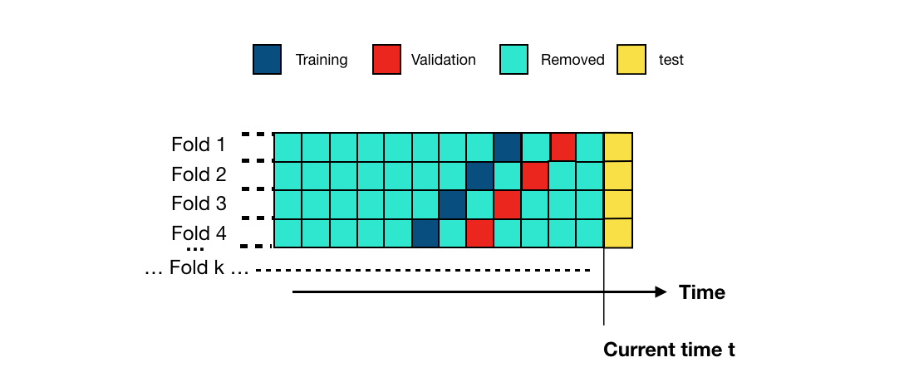
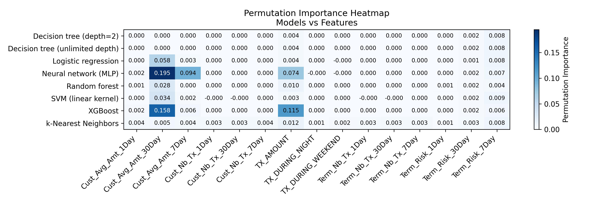
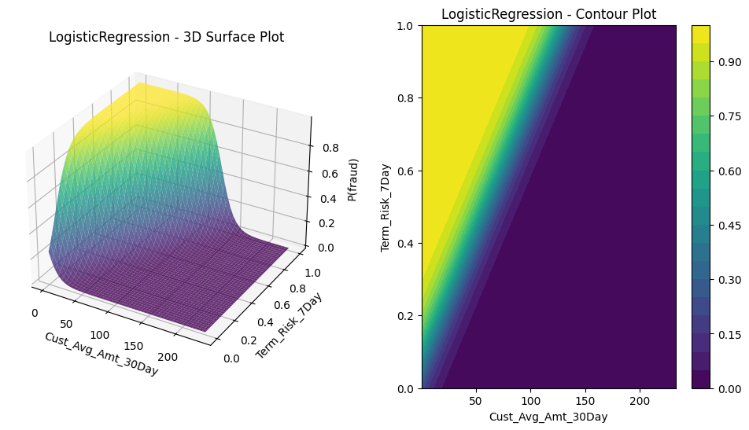
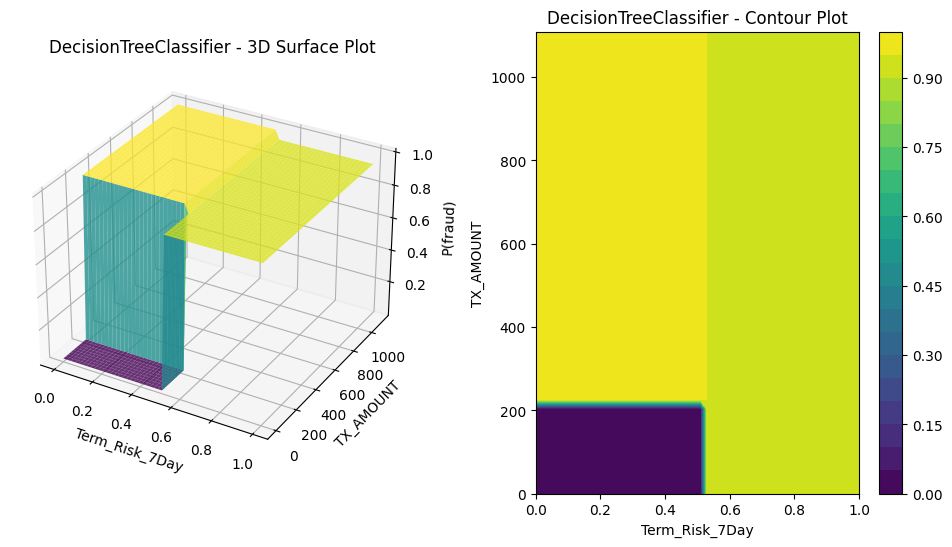
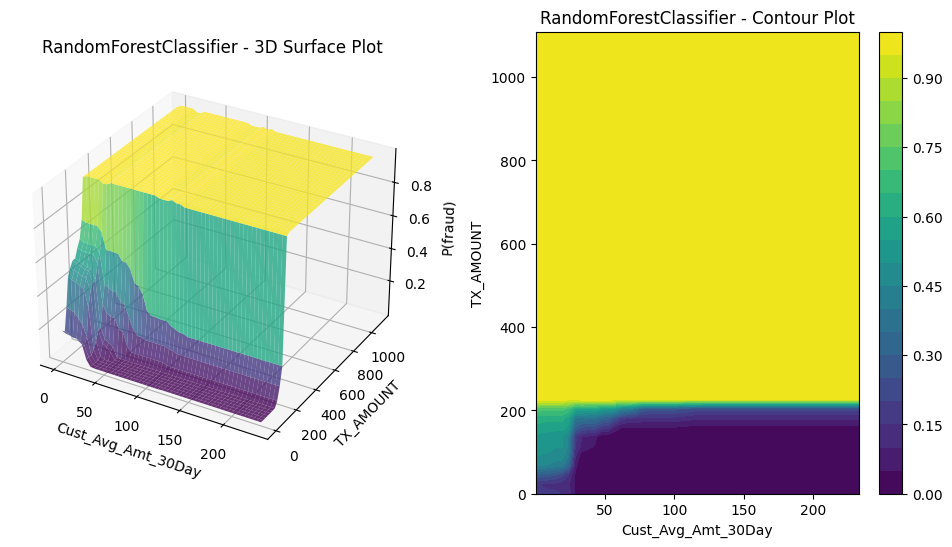
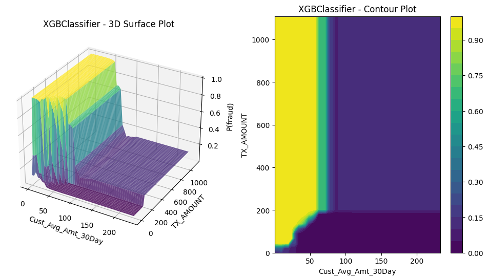
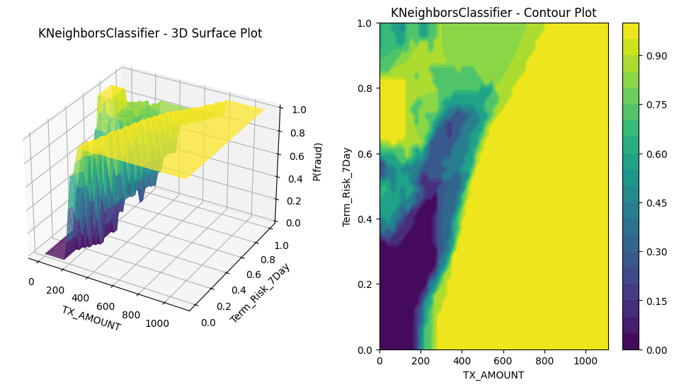

# 5. What do the models look like?

I fit each of our models to the fraud handbook data, using their choice of training dataset and prequential validation (explained below). I used the tuning process we described in the regulariztaion section of [Model formulas](3-model-formulas.md). (Tune the hyperparameters using  (prequential) cross-validation. Tune the model parameters on the full training data using the tuned hyperparameters.)

I modeled TX_FRAUD as a function of the features, omitting the redundant features TX_DATETIME, TX_TIME_SECONDS, and TX_TIME_DAYS (as well as the Id variables and TX_FRAUD_SCENARIO).  

## 5.1 Prequential validation

Because transactions come in a stream of data and since fraud patterns vary over time, fraud models are often 
validated using a variant of cross-validation that reflects these patterns. In *prequential validation*, the training and validation 
folds shift over time, as illustrated in this image from the 
prequential validation from the Handbook:



**Prequential validation illustration, from “2. Validation strategies,” in** *Reproducible Machine Learning for Credit Card Fraud detection - Practical handbook* **by Yann-Aël Le Borgne, Wissam Siblini, Bertrand Lebichot, Gianluca Bontempi, Université Libre de Bruxelles and Worldline Labs.**  
Available at: https://fraud-detection-handbook.github.io/fraud-detection-handbook/Chapter_5_ModelValidationAndSelection/ValidationStrategies.html  
Licensed under CC BY-SA 4.0 (https://creativecommons.org/licenses/by-sa/4.0/)

Specifically, the four folds in the prequential cross-validation consist of all transactions made on the following dates:

<style>
  h2 {
    border-bottom: none !important;
    padding-bottom: 0; /* optionally remove bottom padding */
    margin-bottom: 0.5em; /* adjust spacing below if needed */
  }
</style>

<h2 style="text-align: center;">Prequential Validation Fold Date Ranges</h2>

| Fold | Training Start | Training End | Validation Start | Validation End |
|------|---------------|--------------|------------------|----------------|
| 0    | 2018-07-04    | 2018-07-11   | 2018-07-18       | 2018-07-25     |
| 1    | 2018-07-11    | 2018-07-18   | 2018-07-25       | 2018-08-01     |
| 2    | 2018-07-18    | 2018-07-25   | 2018-08-01       | 2018-08-08     |
| 3    | 2018-07-25    | 2018-08-01   | 2018-08-08       | 2018-08-15     |


Here's code using these prequential folds to fit the models from [Model formulas](3-model-formulas.md):

<details>
<summary>Click to expand/hide Python code fitting the models with 4-fold prequential cross-validation</summary>

<pre> ```python
""" 0. Setting things up """
import pandas as pd
import numpy as np
import datetime
import joblib
import itertools
from scipy.stats import uniform, randint
from sklearn.pipeline import Pipeline
from sklearn.compose import ColumnTransformer
from sklearn.preprocessing import StandardScaler
from sklearn.metrics import log_loss
from sklearn.model_selection import ParameterSampler
from sklearn.linear_model import LogisticRegression
from sklearn.tree import DecisionTreeClassifier
from sklearn.ensemble import RandomForestClassifier
from sklearn.svm import SVC
from sklearn.neighbors import KNeighborsClassifier
from sklearn.neural_network import MLPClassifier
from sklearn.utils import check_random_state
from xgboost import XGBClassifier

# Get data, limit date range
path = "fraud_data_full.parquet"
transactions_df = pd.read_parquet(path, engine="pyarrow")
start_date = "2018-07-04"
end_date = "2018-08-15"
adjusted_end_date = pd.to_datetime(end_date) + pd.Timedelta(days=1) - pd.Timedelta(microseconds=1)
transactions_df = transactions_df[(transactions_df['TX_DATETIME'] >= start_date) & (transactions_df['TX_DATETIME'] <= adjusted_end_date)].reset_index(drop=True)

# Features
output_feature="TX_FRAUD"

input_features=['TX_AMOUNT','TX_DURING_WEEKEND', 'TX_DURING_NIGHT', 'CUSTOMER_ID_NB_TX_1DAY_WINDOW',
       'CUSTOMER_ID_AVG_AMOUNT_1DAY_WINDOW', 'CUSTOMER_ID_NB_TX_7DAY_WINDOW',
       'CUSTOMER_ID_AVG_AMOUNT_7DAY_WINDOW', 'CUSTOMER_ID_NB_TX_30DAY_WINDOW',
       'CUSTOMER_ID_AVG_AMOUNT_30DAY_WINDOW', 'TERMINAL_ID_NB_TX_1DAY_WINDOW',
       'TERMINAL_ID_RISK_1DAY_WINDOW', 'TERMINAL_ID_NB_TX_7DAY_WINDOW',
       'TERMINAL_ID_RISK_7DAY_WINDOW', 'TERMINAL_ID_NB_TX_30DAY_WINDOW',
       'TERMINAL_ID_RISK_30DAY_WINDOW']

# Shorten feature names
rename_map = {}
for window in [1, 7, 30]:
    rename_map[f'CUSTOMER_ID_NB_TX_{window}DAY_WINDOW']       = f'Cust_Nb_Tx_{window}Day'
    rename_map[f'CUSTOMER_ID_AVG_AMOUNT_{window}DAY_WINDOW'] = f'Cust_Avg_Amt_{window}Day'
    rename_map[f'TERMINAL_ID_NB_TX_{window}DAY_WINDOW']      = f'Term_Nb_Tx_{window}Day'
    rename_map[f'TERMINAL_ID_RISK_{window}DAY_WINDOW']       = f'Term_Risk_{window}Day'
    
transactions_df.rename(columns=rename_map, inplace=True)

input_features = [
    rename_map.get(col, col)  # use new name if in map, else keep original
    for col in input_features]

# Models and hyperparameters

# Models dictionary with instantiation
classifiers_dict = {
    'Logistic regression': LogisticRegression(random_state=0, penalty='l2', solver='lbfgs', max_iter=1000),
    'Decision tree (depth=2)': DecisionTreeClassifier(max_depth=2, random_state=0),
    'Decision tree (unlimited depth)': DecisionTreeClassifier(random_state=0),
    'Random forest': RandomForestClassifier(random_state=0, n_jobs=-1),
    'XGBoost': XGBClassifier(random_state=0, n_jobs=-1, use_label_encoder=False, eval_metric='logloss'),
    'SVM (linear kernel)': SVC(kernel='linear', probability=True, random_state=0),
    'k-Nearest Neighbors': KNeighborsClassifier(n_neighbors=5, n_jobs=-1),
    'Neural network (MLP)': MLPClassifier(hidden_layer_sizes=(100,), solver='adam', max_iter=1000, random_state=0)}

# Hyperparameter distributions for all models 
param_distributions = {
    'Logistic regression': {
        'clf__C': uniform(0.01, 10)},                # uniform distribution over [0.01, 10.01)
    'Decision tree (depth=2)': {
        'clf__max_depth': randint(1, 4)},            # integers 1 to 3 inclusive
    'Decision tree (unlimited depth)': {
        'clf__max_depth': randint(1, 21)},           # integers 1 to 20 plus None can be handled separately if needed
        # Note: None not handled by randint, can add separately or treat None as max depth large enough
    'Random forest': {
        'clf__n_estimators': randint(50, 101),       # 50 to 100 trees
        'clf__max_depth': randint(1, 21)},           # 1 to 20
    'XGBoost': {
        'clf__n_estimators': randint(50, 101),       # 50 to 100
        'clf__max_depth': randint(3, 8),             # 3 to 7
        'clf__learning_rate': uniform(0.01, 0.19)},  # 0.01 to 0.2 approx
    'SVM (linear kernel)': {
        'clf__C': uniform(0.1, 9.9),},               # 0.1 to 10
        # gamma excluded since linear kernel
    'k-Nearest Neighbors': {
        'clf__n_neighbors': randint(3, 8),           # 3 to 7
        'clf__weights': ['uniform', 'distance']},    # categorical options
    'Neural network (MLP)': {
        'clf__hidden_layer_sizes': [(50,), (100,), (100, 50)],  # categorical options
        'clf__alpha': uniform(0.0001, 0.0099)}}                # 0.0001 to 0.01 approx

# Pipelines

# Define numeric feature preprocessor
numeric_transformer = Pipeline(steps=[
    ('scaler', StandardScaler())])

preprocessor = ColumnTransformer(
    transformers=[('num', numeric_transformer, input_features)],
    remainder='drop')

# Models requiring standardization
to_standardize = {
    'Logistic regression',
    'SVM (linear kernel)',
    'k-Nearest Neighbors',
    'Neural network (MLP)'}

# Create pipelines applying scaler only to models that need it
pipelines = {}
for name, clf in classifiers_dict.items():
    if name in to_standardize:
        pipelines[name] = Pipeline(steps=[
            ('preprocessor', preprocessor),
            ('clf', clf)])
    else:
        pipelines[name] = Pipeline(steps=[
            ('clf', clf)])

# Setup for prequential cross validation

# Parameters
delta_train = 7          # days
delta_delay = 7          # days
delta_assessment = 7     # days
n_folds = 4
train_start = datetime.datetime.strptime(start_date, "%Y-%m-%d")

# Show the dates of the prequential train and validation folds
print(f"Prequential validation fold date ranges:")
fold_train_start = train_start
for fold in range(n_folds):
    train_end = fold_train_start + datetime.timedelta(days=delta_train)
    val_start = train_end + datetime.timedelta(days=delta_delay)
    val_end = val_start + datetime.timedelta(days=delta_assessment)

    print(f"Fold {fold}:")
    print(f"  Training: {fold_train_start.date()} to {train_end.date()}")
    print(f"  Validation: {val_start.date()} to {val_end.date()}")
    
    fold_train_start = fold_train_start + datetime.timedelta(days=delta_assessment)

""" 1. Tune hyperparameters for a single model with prequeantial cross-validation """

def prequential_randomized_tune_single_model(df, pipeline, param_distributions,
                                             start_date, delta_train, delta_delay, delta_val,
                                             n_folds, input_features, output_feature,
                                             n_iter, random_state=0):
    
    rng = check_random_state(random_state)
    param_list = list(ParameterSampler(param_distributions, n_iter=n_iter, random_state=rng))

    best_params = None
    best_logloss = np.inf
    all_results = []

    for params in param_list:
        fold_loglosses = []
        fold_train_start = train_start
        for fold in range(n_folds):
            train_df, val_df = get_train_val_split(df, fold, fold_train_start, delta_train, delta_delay, delta_val)
 
            if train_df.empty or val_df.empty:
                continue

            X_train = train_df[input_features]
            y_train = train_df[output_feature]
            X_val = val_df[input_features]
            y_val = val_df[output_feature]

            pipeline.set_params(**params)
            pipeline.fit(X_train, y_train)
            y_val_pred_proba = pipeline.predict_proba(X_val)
            logloss = log_loss(y_val, y_val_pred_proba)

            fold_loglosses.append(logloss)
            fold_train_start = fold_train_start + datetime.timedelta(days=delta_assessment)

        if len(fold_loglosses) == 0:
            continue

        avg_logloss = np.mean(fold_loglosses)
        all_results.append({'params': params, 'avg_logloss': avg_logloss})
        print(f"Params: {params}, Avg Log Loss: {avg_logloss:.4f}")

        if avg_logloss < best_logloss:
            best_logloss = avg_logloss
            best_params = params

    return best_params, best_logloss, all_results

X_full_train = transactions_df[input_features]
y_full_train = transactions_df[output_feature]

""" 2. Main loop: Tune all hyperparameters and fit all models """

best_model_name = None
best_model_params = None
best_model_score = np.inf
optimized_pipelines = {}

for model_name, pipeline in pipelines.items():
    print(f"\nTuning model: {model_name}")
    best_params, best_score, results = prequential_randomized_tune_single_model(
        transactions_df, pipeline, param_distributions[model_name],
        train_start, delta_train, delta_delay, delta_assessment,
        n_folds, input_features, output_feature, n_iter=20, random_state=0)
    print(f"Best params for {model_name}: {best_params}, Best Avg Log Loss: {best_score:.4f}")

    if best_score < best_model_score:
        best_model_score = best_score
        best_model_name = model_name
        best_model_params = best_params

    # Set best hyperparameters found
    pipeline.set_params(**best_params)   
    
    # Fit pipeline on full training data
    pipeline.fit(X_full_train, y_full_train)

    # Store the fitted pipeline as optimized for that model
    optimized_pipelines[model_name] = pipeline

print("All models tuned and refitted. Ready for prediction and evaluation.")


``` </pre>
</details>


## 5.2 Permutation importance

To be able to plot anything, I chose the top two features for each model, using permutation feature importance.  I'll plot the models against these two features and fix the values for other features at their means.  


<details>
<summary>Click to expand/hide Python code for permutation importance</summary>

<pre> ```python

""" 3. Compute permutation importance for all models and make a heatmap of the results """

from sklearn.inspection import permutation_importance

feature_importances_records = []

for model_name, clf in classifiers_dict.items():
    print(f"Fitting and evaluating model: {model_name}")
    
    pipeline = pipelines[model_name]

    # Fit model on full dataset
    pipeline.fit(transactions_df[input_features], transactions_df[output_feature])
    
    # Compute permutation importance on full dataset
    perm_result = permutation_importance(
        pipeline,
        transactions_df[input_features],
        transactions_df[output_feature],
        n_repeats=5,
        random_state=0,
        n_jobs=-1
    )
    
    for i, feat in enumerate(input_features):
        feature_importances_records.append({
            'model_name': model_name,
            'feature': feat,
            'importance_mean': perm_result.importances_mean[i],
            'importance_std': perm_result.importances_std[i]
        })

# Convert to DataFrame for further analysis
feature_importance_df = pd.DataFrame(feature_importances_records)

# Make a heatmap of the permutation importance table for all models and features

import matplotlib.pyplot as plt

def plot_permutation_importance_heatmap(df, filename="permutation_importance_heatmap.png"):
    """
    Plots a heatmap of permutation importances given a DataFrame with columns:
    ['model_name', 'feature', 'importance_mean']
    Rows are models, columns are features.
    """

    # Pivot to have models as rows and features as columns
    heatmap_df = df.pivot(index='model_name', columns='feature', values='importance_mean').fillna(0)

    fig, ax = plt.subplots(figsize=(12, max(4, 0.5 * heatmap_df.shape[0])))

    # Plot heatmap with blue color scale, lighter for small values
    cax = ax.imshow(heatmap_df, cmap='Blues', aspect='auto')

    # Show color bar
    cbar = fig.colorbar(cax)
    cbar.set_label('Permutation Importance')

    # Set ticks
    ax.set_xticks(np.arange(len(heatmap_df.columns)))
    ax.set_yticks(np.arange(len(heatmap_df.index)))

    # Label ticks with feature names and model names
    ax.set_xticklabels(heatmap_df.columns, rotation=45, ha='right')
    ax.set_yticklabels(heatmap_df.index)

    # Loop over data dimensions and create text annotations.
    for i in range(len(heatmap_df.index)):
        for j in range(len(heatmap_df.columns)):
            value = heatmap_df.iat[i, j]
            # Determine appropriate text color for readability
            text_color = 'black' if value < heatmap_df.values.max() * 0.65 else 'white'
            ax.text(j, i, f"{value:.3f}", ha='center', va='center', color=text_color, fontsize=8)

    ax.set_title('Permutation Importance Heatmap\nModels vs Features')
    plt.tight_layout()
    plt.savefig(filename, dpi=300)
    plt.show()

plot_permutation_importance_heatmap(feature_importance_df, filename="permutation_importance_heatmap.png")

``` </pre>
</details>

<br>

For example, the top two features for XGBoost were the average amount spent on the card in the past 30 days and the amount of the transaction.  (I shortened the feature names, so these are Cust_Avg_Amt_30Day and TX_AMOUNT.) So, we'll plot XGBoost's probability of fraud against these two features, hold the other features at their means. 




## 5.3 What the models look like

We're now ready to plot. For each model, I made a 3D plot of $P(Y=1 \mid \mathbf{x})$  and the corresponding 2D contour plot, each plotted against the two features with the highest permutation importance. Let's compare them to our understanding from the equations for 
$$P(Y=1 \mid \mathbf{x})$$. (So here, only the two most "important" features in $\mathbf{x}$ are varying.) 

<details>
<summary>Click to expand/hide Python code for plotting the models</summary>

<pre> ```python
"""4. Plot all models"""

import matplotlib.pyplot as plt
from mpl_toolkits.mplot3d import Axes3D  # Required for 3d plotting, no direct usage needed

# Make the surface and contour plots for one model, plotting P(fraud) against its two features with the highest permutation importance
def plot_3d_surface_and_contour_permutation(pipeline, X, feature_pair, name):
    """
    Plot 3D surface and contour of predicted fraud probability vs two features,
    holding other features fixed at mean.
    """

    if feature_pair[0] is None or feature_pair[1] is None:
        print("Skipping plot: insufficient features in permutation importance.")
        return

    feature_1 = feature_pair[0]
    feature_2 = feature_pair[1]

    # Fix other features at their mean
    X_fixed = X.mean().copy()

    # Create grid of values for features 1 and 2
    f1_vals = np.linspace(X[feature_1].min(), X[feature_1].max(), 50)
    f2_vals = np.linspace(X[feature_2].min(), X[feature_2].max(), 50)
    F1_mesh, F2_mesh = np.meshgrid(f1_vals, f2_vals)

    # Prepare input for prediction
    X_plot = np.tile(X_fixed.values, (f1_vals.size * f2_vals.size, 1))

    # Get indices of the features in X.columns
    f1_idx = X.columns.get_loc(feature_1)
    f2_idx = X.columns.get_loc(feature_2)

    # Set grid values in input array
    X_plot[:, f1_idx] = F1_mesh.ravel()
    X_plot[:, f2_idx] = F2_mesh.ravel()

    # Convert to DataFrame for pipeline input
    X_plot_df = pd.DataFrame(X_plot, columns=X.columns)

    # Predict probabilities
    probabilities = pipeline.predict_proba(X_plot_df)[:, 1]

    # Reshape back to mesh shape
    Z = probabilities.reshape(F1_mesh.shape)

    fig = plt.figure(figsize=(12, 6))
    
    # Plot 3D Surface Plot without colorbar
    ax = fig.add_subplot(121, projection='3d')
    surf = ax.plot_surface(F1_mesh, F2_mesh, Z, cmap='viridis', edgecolor='none', alpha=0.8)
    ax.set_xlabel(feature_1)
    ax.set_ylabel(feature_2)
    ax.set_zlabel('P(fraud)')
    ax.set_title(f'{pipeline.named_steps["clf"].__class__.__name__} - 3D Surface Plot')

    # Plot Contour Plot with colorbar
    ax2 = fig.add_subplot(122)
    contour = ax2.contourf(F1_mesh, F2_mesh, Z, cmap='viridis', levels=20)
    ax2.set_xlabel(feature_1)
    ax2.set_ylabel(feature_2)
    ax2.set_title(f'{pipeline.named_steps["clf"].__class__.__name__} - Contour Plot')
    fig.colorbar(contour, ax=ax2)
    
    # Add horizontal space between the two subplots
    plt.subplots_adjust(wspace=0.3)  # increase wspace value to add more space
    
    plt.savefig(f"{name}.png", bbox_inches='tight')
    plt.show()

# Plot all models

for model_name, clf in classifiers_dict.items():

    pipeline = pipelines[model_name]
    
    print(f"Plotting model: {model_name}")
    model_features = feature_importance_df[feature_importance_df['model_name'] == model_name]
    
    # Sort by importance descending
    model_features_sorted = model_features.sort_values(by='importance_mean', ascending=False)
    
    # Select top two features
    top_two_features = model_features_sorted.head(2)
    
    top_feature_names = top_two_features['feature'].tolist()
    print(f"Top two features for {model_name}: {top_feature_names}")
    
    # Generate 3D surface and contour plot for top two features
    plot_3d_surface_and_contour_permutation(
        pipeline,
        transactions_df[input_features],
        top_feature_names,
        name=f"{model_name}_top2_features_surface")
``` </pre>
</details>

<br>

## 5.3.1 Logistic regression

$\textbf{Model form}$: $$P(Y=1 \ | \ \mathbf{x}\in\mathcal{X}) = \sigma(\mathbf{w}^t \mathbf{x} + b) = \frac{1}{1 + \exp(-\sum_{i=1}^n w_i x_i  - b)}$$
 where $b, w_1,..., w_m \in \mathbb{R}$ are the model parameters. 

We expect the model to be a sigmoid surface, which is exactly what it looks like:



## 5.3.2 Decision trees

$\textbf{Model form}$: $$P(Y=1 \mid \mathbf{x}\in\mathcal{X}) = \sum_{t=1}^T r_t \ \mathbb{I}(\mathbf{x}\in L_t)$$ where $\mathbb{I}(.)$ is the boolean indicator function (taking the value 1 if its argument is true and 0 otherwise), the leaves $L_1,... L_T$ are rectanguloids partitioning the feature space, and the "leaf weights" $r_1,..., r_T$ are the class-weighted fraud incidences on the leaves: $$r_t:= \frac{\sum_{i\in L_t} s_i y_i}{\sum_{i\in L_t} s_i}, \forall 1\leq t\leq T$$  

We expect this model to look like a bunch of steps on rectanguloids parallel to the axes, which is exactly what it looks like. As in the Handbook, we fit two decision trees: one constrained to have depth two and one constrained only by the regularization on the number of leaves. Here are their plots, in the same order (i.e., depth-two first).




## 5.3.3 Random forests

$\textbf{Model form}$: $$P(Y=1 \mid \mathbf{x}\in\mathcal{X}) = \frac{1}{K} \sum_{k=1}^K P_k (y=1 \mid \mathbf{x})$$ where $P_k (y=1 \mid \mathbf{x})$ is the prediction from a decision tree $T_k$ trained on a bootstrap sample of size $|\mathcal{D}|$ from the data $\mathcal{D}$ and from a simple random sample of 
$F$ features, for some $F\geq 1$. (The same value of $F$ is used for each tree.)

So the random forest predicts the chance of fraud given $\mathbf{x}\in\mathcal{X}$ to be the average of the class-weighted fraud incidence in the 
$K$ leaves to which $\mathbf{x}$ belongs. If I'm thinking right, I would also expect this model to look like a bunch of steps on rectanguloids parallel to the axes, just a busier version.  Using 100 trees in the forest, each point is on 100 leaves, each of which is a rectanguloid and intersecting rectanguloids gives rise to smaller rectanguloids.



## 5.3.4 Gradient boosted trees

$\textbf{Model form}$: 
$$P(Y=1 \mid \mathbf{x}\in\mathcal{X}) = \sigma(b+\eta \sum_{k=1}^K f_k(\mathbf{x})) = \frac{1}{1+ \exp(-b-\eta \sum_{k=1}^K f_k(\mathbf{x}))}$$ where $b$ is the log-odds of the fraud rate in 
$\mathcal{D}$, $0<\eta<1$ is a hyperparameter (the "learning rate"), $K\geq 1$, and $f_1(\mathbf{x}),..., f_K(\mathbf{x})$ are the predictions from decision trees determined by the boosting algorithm.  

It's hard to imagine what a gradient boosted tree would look like.  We're taking a linear combination of trees that predict log-odds. Maybe this is part of the reason why they work so well in so many situations.



## 5.3.5 Support vector machines

$\textbf{Model form}$: Given a kernel $K:\mathbb{R}^m \times \mathbb{R}^m\rightarrow \mathbb{R}$, $$P(Y=1 \mid \mathbf{x}\in\mathcal{X}) = \sigma \left( A \left( \sum_{i=1}^n w_i (2y_i - 1) K(\mathbf{X}_i, \mathbf{x})+b \right) + B \right)$$

I used the a linear kernel because this had the highest cross-validation AUC on the training data:

<details>
<summary>Click to expand/hide Python code to find the best SVM kernel</summary>

<pre> ```python
""" 5. Find the best SVM kernel """

from scipy.stats import uniform, randint

# Extend the classifiers_dict for other SVM kernels
classifiers_dict.update({
    'SVM (poly kernel)': SVC(kernel='poly', probability=True, random_state=0),
    'SVM (rbf kernel)': SVC(kernel='rbf', probability=True, random_state=0),
    'SVM (sigmoid kernel)': SVC(kernel='sigmoid', probability=True, random_state=0),
})

# Add hyperparameter distributions for the new kernels
# Note: For non-linear kernels, gamma is important
param_distributions.update({
    'SVM (poly kernel)': {
        'clf__C': uniform(0.1, 9.9),
        'clf__degree': randint(2, 6),        # Polynomial degree 2-5
        'clf__gamma': ['scale', 'auto'],     # Kernel coefficient
        'clf__coef0': uniform(0, 10)         # Independent term in kernel function
    },
    'SVM (rbf kernel)': {
        'clf__C': uniform(0.1, 9.9),
        'clf__gamma': ['scale', 'auto']      # Kernel coefficient
    },
    'SVM (sigmoid kernel)': {
        'clf__C': uniform(0.1, 9.9),
        'clf__gamma': ['scale', 'auto'],
        'clf__coef0': uniform(0, 10)
    }
})

# Set up pipelines for the new SVM kernels (they require scaling)
to_standardize.update({
    'SVM (poly kernel)',
    'SVM (rbf kernel)',
    'SVM (sigmoid kernel)'
})

for name, clf in classifiers_dict.items():
    if name in to_standardize:
        pipelines[name] = Pipeline([
            ('preprocessor', preprocessor),
            ('clf', clf)
        ])
    else:
        pipelines[name] = Pipeline([
            ('clf', clf)
        ])

optimized_pipelines = {}

# Tune the SVM with each kernel using the prequential_randomized_tune_single_model:
for svm_kernel in ['SVM (poly kernel)', 'SVM (rbf kernel)', 'SVM (sigmoid kernel)']:
    print(f"\nTuning model: {svm_kernel}")
    best_params, best_score, all_results = prequential_randomized_tune_single_model(
        transactions_df, pipelines[svm_kernel], param_distributions[svm_kernel],
        train_start, delta_train, delta_delay, delta_assessment,
        n_folds, input_features, output_feature, n_iter=20, random_state=0)
    print(f"Best params for {svm_kernel}: {best_params}, Best Avg Log Loss: {best_score:.4f}")

    # Set best hyperparameters and fit on full data
    pipelines[svm_kernel].set_params(**best_params)
    pipelines[svm_kernel].fit(transactions_df[input_features], transactions_df[output_feature])

    # Save or store your optimized pipelines as needed
    optimized_pipelines[svm_kernel] = pipelines[svm_kernel]

print("All SVM kernels tuned and refitted. Ready for evaluation.")

from sklearn.metrics import roc_auc_score
from joblib import Parallel, delayed

# Map kernels to pipeline keys exactly as saved
svm_kernel_map = {
    'linear': 'SVM (linear kernel)',
    'poly': 'SVM (poly kernel)',        # Confirm key names exist
    'rbf': 'SVM (rbf kernel)',
    'sigmoid': 'SVM (sigmoid kernel)'
}

def evaluate_kernel_fold(kernel, pipe_key, fold):
    # Precompute train and val splits once outside if needed
    train_df_fold, val_df_fold = get_train_val_split(transactions_df, fold, train_start, delta_train, delta_delay, delta_assessment)

    X_train = train_df_fold[input_features]
    y_train = train_df_fold[output_feature]
    X_val = val_df_fold[input_features]
    y_val = val_df_fold[output_feature]

    pipeline = pipelines[pipe_key]
    # Only fit if pipeline is not already fitted.
    # If pre-fitted, skip this step for speed (add check if possible)
    pipeline.fit(X_train, y_train)

    val_probs = pipeline.predict_proba(X_val)[:, 1]
    auc = roc_auc_score(y_val, val_probs)
    return auc

def evaluate_kernel(kernel, pipe_key):
    aucs = Parallel(n_jobs=12)(delayed(evaluate_kernel_fold)(kernel, pipe_key, fold) for fold in range(n_folds))
    mean_auc = np.mean(aucs)
    print(f"Kernel: {kernel}, Mean Prequential CV AUC: {mean_auc:.4f}")
    return kernel, mean_auc

results = []
for kernel, pipe_key in svm_kernel_map.items():
    if pipe_key not in pipelines:
        print(f"Pipeline for kernel '{kernel}' not found, skipping.")
        continue
    results.append(evaluate_kernel(kernel, pipe_key))

# Find best kernel
best_kernel, best_score = max(results, key=lambda x: x[1])
print(f"\nBest kernel by Prequential CV AUC: {best_kernel} with score {best_score:.4f}")

``` </pre>

</details>

```text

Kernel: linear, Mean Prequential CV AUC: 0.8953
Kernel: poly, Mean Prequential CV AUC: 0.8538
Kernel: rbf, Mean Prequential CV AUC: 0.8921
Kernel: sigmoid, Mean Prequential CV AUC: 0.4558

Best kernel by Prequential CV AUC: linear with score 0.8953
```

With a linear kernel, $\sum_{i=1}^n w_i (2y_i - 1) K(\mathbf{X}_i, \mathbf{x})+b$ is just a linear combination of the entries of $\mathbf{x}$.  So, the decision boundary is a hyperplane, and like logistic regression, the probability surface looks like a sigmoid surface.


## 5.3.6 K-nearest neighbors

$$\textbf{Model form}$$: Given 
$$k\geq 1$$, estimate 
$$P(Y=1 \mid \mathbf{x}\in\mathcal{X}) = \frac{\sum_{i\in N_k(\mathbf{x})} s_i y_i}{\sum_{i\in N_k(\mathbf{x})} s_i}$$ where 
$$N_k(\mathbf{x})$$ is the set of indices of the $$k$$ samples in $$\mathcal{D}$$ with the $k$ smallest values of 
$$||\mathbf{X}_i - \mathbf{x}||$$. 

We expect this to look like a smoothed version of the raw fraud surface, kind of akin to taking moving averages in a time series.



## 5.3.7 Neural networks

$\textbf{Model form (for MLP)}$: Given $L\geq 1$,
$$P(Y=1 \mid \mathbf{x}\in\mathcal{X}) = \sigma(W_L a_{L-1} + b_L)$$ 
where $a_0:=\mathbf{x}$ and for each 
$1\leq k\leq L-1$, $a_k:=ReLU(W_k a_{k-1} + b_k)$. So the model parameters are the $m\times m$ matrices $W_k$ and the vectors $b_k\in\mathbb{R}^m$.

It's hard for me to imagine a general pattern for what neural network models look like.  In a way, I am surpised by how smooth (in the sense of not very bumpy) the result is. Of course, this could be an artifact of holding all non-displayed features constant. 

_top2_features_surface.png)

# Up next

So, we have fit a bunch of models. Next, we'll look at how to evaluate them.


<table width="100%">
  <tr>
    <td align="left">
      <a href="4-the-data-we-use.html">← Previous: 4. The data we use</a>
    </td>
    <td align="right">
      <a href="6-performance-metrics.html">Next: 6. Performance metrics →</a>
    </td>
  </tr>
</table>