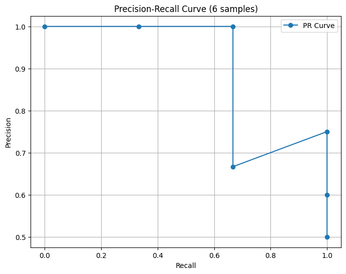
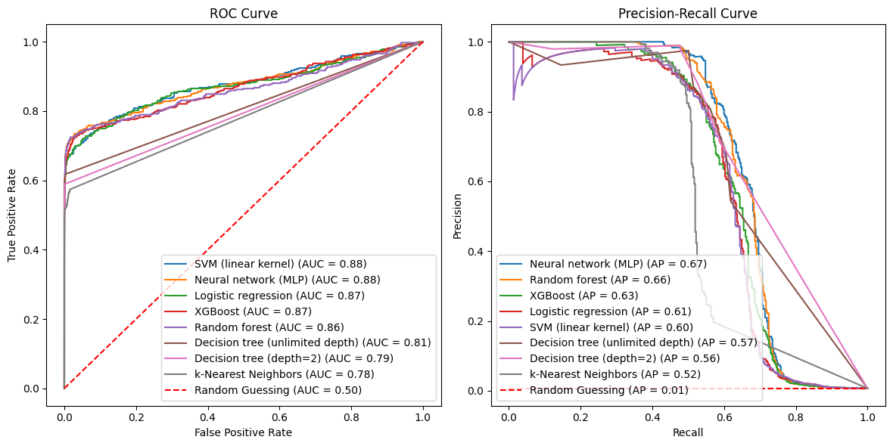
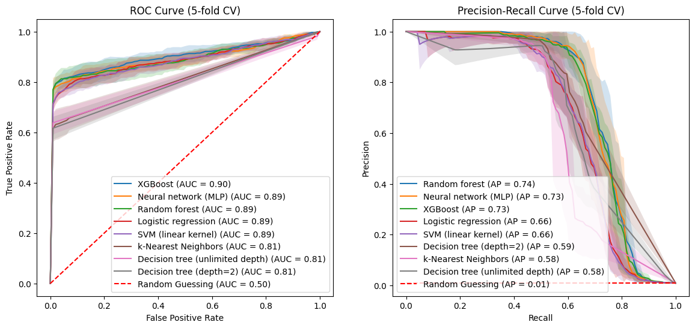
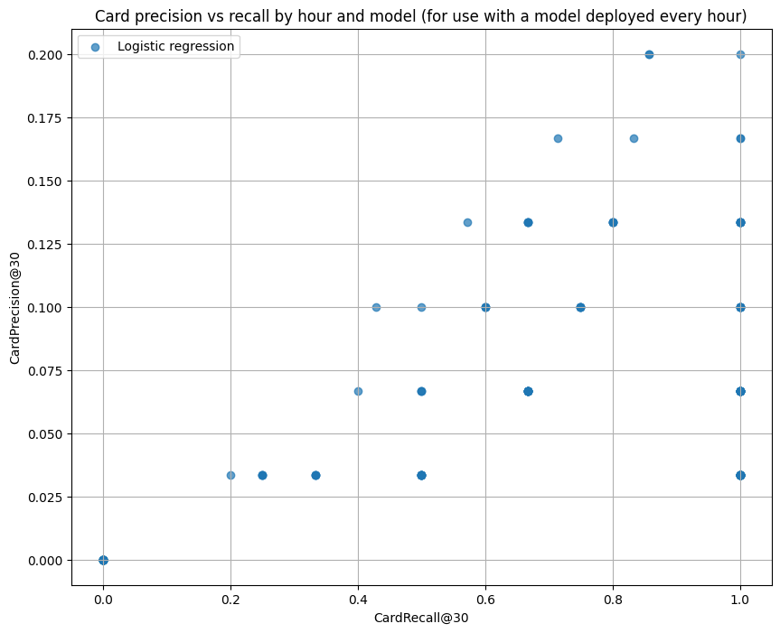
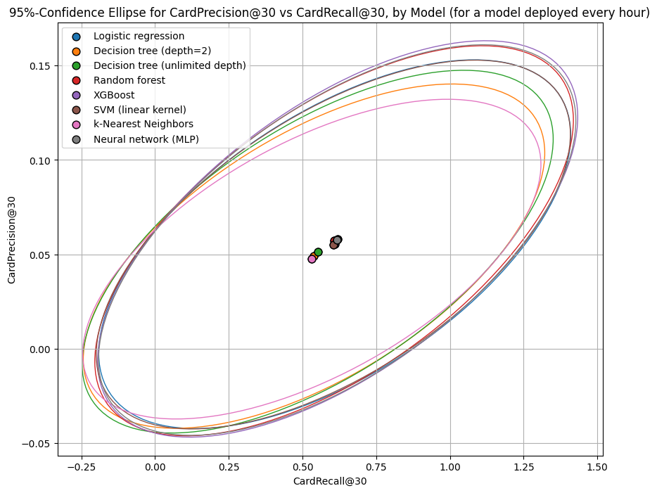

# 6. Performance metrics

In Section 5 (What do the models look like?), we fit and tuned our models according to regularized log-loss. While this isn't unreasonable, it wouldn't make much sense to compare the performance of models using regularized log-loss.  For instance, the regularization for tree-based models involved the numbers of leaves, while that for logistic regression used the length of the weight vector.

According to the Handbook, the ROC AUC is "currently the de-facto metric for assessing fraud detection accuracies". But the Handbook also points to recent research that this metric can be misleading for highly imbalanced data and that the area under the Precision-Recall curve is recommended over ROC AUC.  As you would expect, the choice of metric is tied to business objectives. So let's take a closer look at performance metrics commonly used to assess fraud detection models.

In broad terms, the objective is obvious: you want to catch as much fraud as you can, while misidentifying legit transactions as fraud as little as possible. The challenge in choosing a metric is two-fold:

- fraud is very rare (often less than 0.1% of transactions), and

- the cost of false negatives (failing to catch fraud) is generally much higher than the cost of false positives (predicting a legitimate transaction to be fraud)

## 6.1 Setup

All but one of our models output probabilities, not classifications. So, if a fraud detection system operates by flagging transactions as potentially fraudulent, we need to translate the probabilities into these flags.  The most natural way would seem to be to specify a probability threshold, above which all transactions are flagged as potential fraud.

To do this, consider a model $f_{\mathbf{w}}: \mathcal{X}\rightarrow [0,1]$ that models $P(y=1 \mid \mathbf{x})$, the probability that a transaction with given features is fraudulent. Consider an experiment in which we randomly select a transaction $(\mathbf{x}, y)$ and compute $T:=f_{\mathbf{w}}(\mathbf{x})$ so $T$ is a random variable with values in [0,1].  Further, compute:

$$
\hat{Y}_t := \begin{cases}
1 & \text{if } T > t\\
0 & \text{otherwise}
\end{cases}
$$

so $\hat{Y}_t$ and the true classification $y$ are also random variables with values in {0,1}. At the two extremes, the classifier $\hat{Y}_0$ classifies all but the probability zero cases as fraud, while $\hat{Y}_1$ classifies nothing as fraud.

## 6.2 Threshold-based metrics

I will only consider some of the many metrics used.

The true positive rate and the false positive rate at a given threshold are:  

$$\text{TPR}(t) := P(\hat{Y}_t = 1 \mid Y = 1)$$

$$\text{FPR}(t) := P(\hat{Y}_t = 1 \mid Y = 0)$$

where $Y$ denotes the true label. 

The true positive rate is also called $recall$.  We will sometimes use the notation $\mathrm{Recall}(t)$ instead of $\text{TPR}(t)$. Also:

$$\mathrm{Precision}(t) := P( Y = 1 \mid \hat{Y}_t = 1 )$$

So all three metrics (TPR, FPR, and Precision) are functions from [0,1] to [0,1].  

### 6.2.1 Properties of TPR (Recall), FPR, and Precision

#### Continuity (or lack thereof)
These functions might or might not be continuous, depending on the model. E.g. for logistic regression, the unconditional probabilities $P(\hat{Y}_t =1)$ is one minus the cdf of the model probabilities, is continuous.  For locally constant models like tree-based methods, we wouldn't expect TPR, FPR, or Precision to be continuous. 

#### Values at thresholds 0 and 1
I think it's worth taking a look at these because the values you get from the definitions can be at odds with convention. To start, we have 
$$\text{TPR}(0) = \mathrm{Recall}(0) = P(T>0 \mid Y = 1),$$ 
i.e. the chance that a randomly selected fraudulent transaction $(\mathbf{x},1)$ is predicted with non-zero probability to be fraud. Likewise, we have 
$$\text{FPR}(0) = P(T>0 \mid Y = 0) \text{ and } \text{Precision}(0) = P(Y=1 \mid T>0)$$ 
Note that if we extended the definitions of TPR, FPR, and Precision a little to the left of zero, say to $-\epsilon$ where $\epsilon>0$ is small, then we'd have:
$$\text{TPR}(-\epsilon) = \mathrm{Recall}(-\epsilon) = \text{FPR}(-\epsilon) = 1 \text{ and } \text{Precision}(-\epsilon) = P(Y=1)$$

This might be why some seem to define $\text{TPR}(0)$ and $\text{FPR}(0)$ to be $1$.

To make things even more confusing, some define TPR, FPR, and Precision using $\geq t$ instead of $>t$.  Not that this fixes our issue with $t=0$. (It just shifts the problem to $t=1$.)

More straightforwardly, we have 
$$\text{TPR}(1)=\mathrm{Recall}(1)=0, \text{FPR}(1)=0, \text{ and } \text{Precision}(1) \text{ is undefined}$$
since $Y_1$ never predicts fraud.  Some seem to use the convention to define $\text{Precision}(1)$ to be 0. (You can control this in scikit-learn's precision_score metric with the parameter zero_division.) 

Taking another simple example, consider a constant model that predicts $P(y=1 \mid \mathbf{x})=p_0$ regardless of $\mathbf{x}$. With this model, $\hat{Y}_t$ is also a constant random variable.  It classifies all tx to be fraud when $t<p_0$ and all tx to be legit when $t\geq p_0$.

#### Monotonicity (or lack thereof)
Note that TPR (Recall) and FPR are decreasing functions of $t$. We would expect Precision to be increasing, in the sense that the higher probabilities of a good model should identify an increasing share of fraud.

Of course, you can estimate any of these quantities (TPR, FPR, Precision) at any given threshold using data containing fraud and legit transactions (and for $\text{Precision}(t)$, you'll need cases that your model predicts to be fraud with probability > t). Evaluation metrics should reflect generalized performance, so should be estimated from validation data.

## 6.3 Threshold-free metrics 

I will only look at the ROC AUC and AP. 

### 6.3.1 ROC curve and PR curves 

Both ROC and PR (Precision-Recall) are parametric curves, parametrized by the threshold in a classification. They are defined by: 

$$\mathrm{ROC}(t) = \big( \mathrm{FPR}(t), \, \mathrm{TPR}(t) \big) = \left( P(\hat{Y}_t = 1 \mid Y = 0), \, P(\hat{Y}_t = 1 \mid Y = 1) \right)$$

$$\mathrm{PR}(t) = \big( \mathrm{Recall}(t), \, \mathrm{Precision}(t) \big) = \left( P(\hat{Y}_t = 1 \mid Y = 1), \, P(Y = 1 \mid \hat{Y}_t = 1) \right)$$

so each is a function from [0,1] to the unit square [0,1] $\times$ [0,1].


### 6.3.2 Properties of the ROC and PR curves

#### The starts and ends of the curves
Looking at the start and end of these curves, we have 
$$\mathrm{ROC}(0) = (P(T>0 \mid Y = 0),P(T>0 \mid Y = 1))$$ 
If we extend the definition of ROC a little to the left of zero, say to $-\epsilon$ where $\epsilon>0$ is small, we would get
$$\mathrm{ROC}(-\epsilon) = (P(T\geq 0 \mid Y = 0),P(T\geq 0 \mid Y = 1))=(1,1)$$ 

$$\mathrm{ROC}(1) = (0,0)$$ 
$$\mathrm{PR}(0) = (T>0 \mid Y = 1), P(Y=1 \mid T>0))$$ 

And $\mathrm{PR}(1)$ is either undefined or $(0,0)$ depending on your convention. That said, some seem to define the ROC curve so that $\mathrm{ROC}(0)=(1,1)$

#### Monotonicity (or lack thereof)

You would expect the ROC curve to be non-decreasing, i.e. that you can't reduce the FPR by increasing the TPR. And it is. [^1] 

The Precision-Recall curve isn't monotonic.  Increasing the recall (TPR) can increase or decrease precision.  We'll see this in some of our models below.


#### Areas under the curves

To get a summary of performance of a given model over all possible thresholds, people often look at the area under these curves $-$ the ROC AUC (area under curve) and PR AUC (aka average precision, or AP).

Area under a curve makes most sense when the curve expresses one variable as a function of the other. (If a given point on the x-axis has two y-axis values, which one do you want the region under?)

We saw earlier that this is true for the ROC curve, indeed FPR is a non-decreasing function of TPR. But it isn't true for the PR curve: two different thresholds can yield the same recall but different precisions. Here is an example:


<details>
<summary>Click to expand/hide Python code</summary>

<pre> ```python
import pandas as pd
from sklearn.metrics import precision_recall_curve
import matplotlib.pyplot as plt

# Create the DataFrame with 6 samples
data = {
    'sample': [1, 2, 3, 4, 5, 6],
    'true_label': [1, 1, 0, 1, 0, 0],
    'predicted_proba': [0.9, 0.8, 0.7, 0.6, 0.5, 0.4]
}
df = pd.DataFrame(data)

# Extract true labels and predicted probabilities
y_true = df['true_label']
y_scores = df['predicted_proba']

# Compute precision-recall pairs
precision, recall, thresholds = precision_recall_curve(y_true, y_scores)

# Plot Precision-Recall curve
plt.figure(figsize=(8,6))
plt.plot(recall, precision, marker='o', label='PR Curve')
plt.xlabel('Recall')
plt.ylabel('Precision')
plt.title('Precision-Recall Curve (6 samples)')
plt.grid(True)
plt.legend()
plt.savefig("Precision-isnt-a-fnc-of-recall.png", bbox_inches='tight')   
plt.show()

``` </pre>
</details>




But even in such cases, it seems you can still make sense of the area under the PR curve by taking the area under the largest precision for a given recall. (Or use the smallest, since they share the same x-value.) There's no danger of the curve doubling back and creating a curve (like a circle) where there's truly an ambiguity in talking about the area underneath, because recall is a non-decreasing function of threshold. 

The area under the ROC curve for a given model is equal to the chance that the model will give a randomly selected fraud a higher probability than it will give a a randomly selected legit transaction. [^3]

The area under the PR curve doesn't have a simple interpretation. [^2]  It is estimated on validation data (or cross-validation folds) as a trapezoidal version of a Riemann sum.

Related to the area under the PR curve is the Average Precision. It is the weighted sum of precision values weighted by changes in recall values at different prediction score thresholds. Geometrically, it is a Riemmann sum estimation of the area under the PR curve, but with bins of unequal width (corresponding to the recall values in your validation data). 

The biggest knock on the ROC curve and its AUC is that they both include ranges of FPRs that you would never consider using in real life. E.g., a FPR of 10% would surely be unacceptable, so why include it when assessing a model's performance? I'm not sure why the PR curve doesn't receive similar criticism for including surely unacceptable levels of recall (e.g. only catching 10 percent of fraud).


### 6.3.3 The ROC and PR curves for our models

Here's what the curves look like for our models.  In the first set of plots, I plotted the (estimated) curves on the Handbook's test dataset.  The curve for a given model is estimated using each distinct predicted probability as a threshold and then interpolating in between the resulting points.  So for a model that predicts x distinct probabilities on the test data, the ROC and PR curves estimated from the same data will plot x data points and interpolate the rest.  This "x" varies a lot for our models:


<details>
<summary>Click to expand/hide Python code</summary>

<pre> ```python
import numpy as np
X_test, y_test = test_df[input_features], test_df['TX_FRAUD']

# Collect model names and counts of distinct probabilities
rows = []
for name, pipe in optimized_pipelines.items():
    probs = pipe.predict_proba(X_test)[:, 1]
    num_distinct = len(np.unique(probs))
    rows.append((name, num_distinct))
    
# Sort by number of distinct probabilities (ascending)
rows.sort(key=lambda x: x[1])

# Create Markdown table string with commas in numbers
md_table = "| Model Name | Number of Distinct Probabilities |\n"
md_table += "|------------|----------------------------------|\n"
for name, count in rows:
    md_table += f"| {name} | {count:,} |\n"

print(md_table)

``` </pre>
</details>


| Model Name | Number of Distinct Probabilities |
|------------|----------------------------------|
| Decision tree (depth=2) | 7 |
| Decision tree (unlimited depth) | 9 |
| k-Nearest Neighbors | 939 |
| XGBoost | 52,662 |
| Random forest | 58,010 |
| SVM (linear kernel) | 58,228 |
| Neural network (MLP) | 58,261 |
| Logistic regression | 58,264 |

So the (estimated) ROC and PR curves for the depth-two decision tree will plot 7 points and interpolate the rest, while those for logistic regression will do the same with 58,264 points. Moreover, as our models will illustrate, these points can be far from equally spaced along the x-axis. 

The red dashed lines in each plot reflect the constant models (randomly guessing $x$ percent of transactions to be fraud, regardless of their features, for $x\in [0.1]$).  These will have FPR=TPR and Precision equal to the fraud rate in the test data.   


<details>
<summary>Click to expand/hide Python code</summary>

<pre> ```python
import matplotlib.pyplot as plt
from sklearn.metrics import roc_curve, auc, precision_recall_curve, average_precision_score

def plot_roc_pr_curves(optimized_pipelines, X_test, y_test):
    plt.figure(figsize=(14, 6))

    # Gather ROC data and sort by decreasing AUC
    roc_data = []
    for name, pipe in optimized_pipelines.items():
        probs = pipe.predict_proba(X_test)[:, 1]
        fpr, tpr, _ = roc_curve(y_test, probs)
        roc_auc = auc(fpr, tpr)
        roc_data.append((name, fpr, tpr, roc_auc))
    roc_data.sort(key=lambda x: x[3], reverse=True)

    # Plot ROC Curve
    plt.subplot(1, 2, 1)
    for name, fpr, tpr, roc_auc in roc_data:
        plt.plot(fpr, tpr, label=f'{name} (AUC = {roc_auc:.2f})')
    random_roc_auc = 0.5
    plt.plot([0, 1], [0, 1], 'r--', label=f'Random Guessing (AUC = {random_roc_auc:.2f})')  
    plt.xlabel('False Positive Rate')
    plt.ylabel('True Positive Rate')
    plt.title('ROC Curve')
    plt.legend(loc='lower right')

    # Gather PR data and sort by decreasing AP
    pr_data = []
    for name, pipe in optimized_pipelines.items():
        probs = pipe.predict_proba(X_test)[:, 1]
        precision, recall, _ = precision_recall_curve(y_test, probs)
        ap = average_precision_score(y_test, probs)
        pr_data.append((name, recall, precision, ap))
    pr_data.sort(key=lambda x: x[3], reverse=True)

    # Plot Precision-Recall Curve
    plt.subplot(1, 2, 2)
    for name, recall, precision, ap in pr_data:
        plt.plot(recall, precision, label=f'{name} (AP = {ap:.2f})')
    # Add dashed line for random guessing (constant model)
    positive_rate = y_test.mean()
    random_ap = positive_rate
    plt.plot([0, 1], [positive_rate, positive_rate], 'r--', label=f'Random Guessing (AP = {random_ap:.2f})')
    plt.xlabel('Recall')
    plt.ylabel('Precision')
    plt.title('Precision-Recall Curve')
    # Place legend in lower left for PR curve with sorted entries
    plt.legend(loc='lower left')

    plt.tight_layout(rect=[0, 0, 0.85, 1])  # Make room on right for ROC legend
    plt.savefig("ROC-and-PR-curves-from-test-data.png", bbox_inches='tight')
    plt.show()

X_val, y_val = test_df[input_features], test_df['TX_FRAUD']
plot_roc_pr_curves(optimized_pipelines, X_val, y_val)

``` </pre>
</details>



Why do the ROC curves for the decision trees and the the k-nearest neighbor models look light straight lines, except at the very smallest FPRs? This is because the first one or two smallest predicted probabilties t for each model have TPR(t) $\approx$ FPR(t) $\approx$ 1, generating the point (1,1), or a point very close to it, on the ROC curve.  But with the next smallest probability (e.g. t=0.1531 for the depth-two tree), the FPR plummets (to 0.001572 for the same tree). You can see the same phenomenon for all three models in the following table, which presents the TPR, FPR, and Precision for the five thresholds given by the smallest five predicted probablities on the test data for these three models.

<details>
<summary>Click to expand/hide Python code</summary>

<pre> ```python
from sklearn.metrics import confusion_matrix

# Target model keywords
target_model_keywords = ['tree', 'Neighbor']

def tpr_fpr_precision_at_threshold(y_true, y_probs, threshold):
    # Assign class 1 if prob >= threshold else 0
    y_pred = (y_probs >= threshold).astype(int)
    tn, fp, fn, tp = confusion_matrix(y_true, y_pred).ravel()
    
    tpr = tp / (tp + fn) if (tp + fn) > 0 else 0
    fpr = fp / (fp + tn) if (fp + tn) > 0 else 0
    precision = tp / (tp + fp) if (tp + fp) > 0 else 0
    
    return tpr, fpr, precision

# Store results for printing
results = []

for name, pipe in optimized_pipelines.items():
    if any(keyword in name for keyword in target_model_keywords):
        probs = pipe.predict_proba(X_test)[:, 1]
        unique_probs = np.unique(probs)
        # Take the 5 smallest unique probabilities as thresholds
        thresholds = unique_probs[:5]
        
        for threshold in thresholds:
            tpr, fpr, precision = tpr_fpr_precision_at_threshold(y_test, probs, threshold)
            results.append({
                'Model': name,
                'Threshold': threshold,
                'TPR (Recall)': tpr,
                'FPR': fpr,
                'Precision': precision
            })

# Convert to DataFrame for pretty printing
df_results = pd.DataFrame(results)
df_results[['Threshold', 'TPR (Recall)', 'FPR', 'Precision']] = df_results[['Threshold', 'TPR (Recall)', 'FPR', 'Precision']].apply(lambda x: x.map(lambda v: f"{v:.4g}"))

# Build Markdown table string
md_table = "| Model | Threshold | TPR (Recall) | FPR | Precision |\n"
md_table += "|-------|-----------|-----|-----|-----------|\n"
for _, row in df_results.iterrows():
    md_table += f"| {row['Model']} | {row['Threshold']} | {row['TPR (Recall)']} | {row['FPR']} | {row['Precision']} |\n"

print(md_table)

``` </pre>
</details>

| Model | Threshold | TPR (Recall) | FPR | Precision |
|-------|-----------|-----|-----|-----------|
| Decision tree (depth=2) | 0 | 1 | 1 | 0.006608 |
| Decision tree (depth=2) | 0.003317 | 1 | 0.9989 | 0.006615 |
| Decision tree (depth=2) | 0.1531 | 0.5896 | 0.001572 | 0.7138 |
| Decision tree (depth=2) | 0.2167 | 0.5273 | 0.0004838 | 0.8788 |
| Decision tree (depth=2) | 0.6 | 0.4779 | 6.911e-05 | 0.9787 |
| Decision tree (unlimited depth) | 0 | 1 | 1 | 0.006608 |
| Decision tree (unlimited depth) | 0.002958 | 1 | 0.9989 | 0.006615 |
| Decision tree (unlimited depth) | 0.05263 | 0.6286 | 0.004181 | 0.5 |
| Decision tree (unlimited depth) | 0.08046 | 0.6156 | 0.002592 | 0.6124 |
| Decision tree (unlimited depth) | 0.08791 | 0.5922 | 0.001572 | 0.7147 |
| k-Nearest Neighbors | 0 | 1 | 1 | 0.006608 |
| k-Nearest Neighbors | 0.09534 | 0.574 | 0.01456 | 0.2077 |
| k-Nearest Neighbors | 0.1021 | 0.574 | 0.01455 | 0.2079 |
| k-Nearest Neighbors | 0.1024 | 0.574 | 0.01453 | 0.2081 |
| k-Nearest Neighbors | 0.1029 | 0.574 | 0.01451 | 0.2083 |

Note in contrast that the ROC curves for the other five models are based on data points with much more evenly spaced FPRs. We see similar behavior in the PR curves in the regions with higher recall (TPR $\geq$ 0.6-ish), for the same reason.

Now, let's look at another oddity. In the PR plots, we see isolated points where precision increases as a function of recall. Let's look at one such case, namely for the tree of unlimited depth. Usually you don't expect to be able to increase both precision and recall. But in this case by dropping the threshold from 1 to 0.9856, you flag 137 more fraud cases in the test data as fraudulent, while only flagging one additional legit transaction as fraud: 

<details>
<summary>Click to expand/hide Python code</summary>

<pre> ```python

# Target model name for the unlimited depth tree
target_model_name = "Decision tree (unlimited depth)"

# Thresholds of interest rounded to 4 significant digits
target_thresholds = [0.9856, 1.0]

results = []

for name, pipe in optimized_pipelines.items():
    if name == target_model_name:
        probs = pipe.predict_proba(X_test)[:, 1]
        for threshold in target_thresholds:
            tpr, fpr, precision, tp, fp, tn, fn = tpr_fpr_precision_at_threshold(y_test, probs, threshold)
            results.append({
                'Model': name,
                'Threshold': f"{threshold:.4g}",
                'TPR (Recall)': f"{tpr:.4g}",
                'FPR': f"{fpr:.4g}",
                'Precision': f"{precision:.4g}",
                'TP': f"{tp:,}",
                'FP': f"{fp:,}",
                'TN': f"{tn:,}",
                'FN': f"{fn:,}"
            })

# Create DataFrame and print markdown table
df_results = pd.DataFrame(results)

md_table = "| Model | Threshold | TPR (Recall) | FPR | Precision | TP | FP | TN | FN |\n"
md_table += "|-------|-----------|--------------|-----|-----------|----|----|----|----|\n"
for _, row in df_results.iterrows():
    md_table += (f"| {row['Model']} | {row['Threshold']} | {row['TPR (Recall)']} | "
                 f"{row['FPR']} | {row['Precision']} | {row['TP']} | {row['FP']} | "
                 f"{row['TN']} | {row['FN']} |\n")

print(md_table)
``` </pre>
</details>


| Model | Threshold | TPR (Recall) | FPR | Precision | TP | FP | TN | FN |
|-------|-----------|--------------|-----|-----------|----|----|----|----|
| Decision tree (unlimited depth) | 0.9856 | 0.5065 | 8.639e-05 | 0.975 | 195 | 5 | 57,874 | 190 |
| Decision tree (unlimited depth) | 1 | 0.1506 | 6.911e-05 | 0.9355 | 58 | 4 | 57,875 | 327 |

Of course, while this happened in the test data, it might not happen for other transactions.

In the next pair of plots, I plotted the curves from the validation folds in a stratified 5-fold cross validation of the training data. Each curve is centered at the average TPR and FPR of the validation folds.  The shaded areas reflect +/- one standard deviation around these averages.  (ML engineers seem to like to use one standard deviation to indicate spread, rather than e.g. 95% confidence intervals.) 

To put a finer point on things, note that e.g. the PR curve for the logistic model actually uses 5 different logistic models, one for each train-validation split of the training data via the 5 folds. 

<details>
<summary>Click to expand/hide Python code</summary>

<pre> ```python

def plot_roc_pr_curves_cv(optimized_pipelines, X, y, cv=5):
    plt.figure(figsize=(14, 6))
    cv = StratifiedKFold(n_splits=cv)

    # Prepare plotting variables for ROC and PR
    mean_fpr = np.linspace(0, 1, 100)
    mean_recall = np.linspace(0, 1, 100)

    roc_results = {}
    pr_results = {}

    for name, pipe in optimized_pipelines.items():
        tprs = []
        aucs = []
        precisions = []
        aps = []
        for train_idx, val_idx in cv.split(X, y):
            X_train, X_val = X.iloc[train_idx], X.iloc[val_idx]
            y_train, y_val = y.iloc[train_idx], y.iloc[val_idx]

            pipe.fit(X_train, y_train)
            probs = pipe.predict_proba(X_val)[:, 1]

            # ROC
            fpr, tpr, _ = roc_curve(y_val, probs)
            interp_tpr = np.interp(mean_fpr, fpr, tpr)
            interp_tpr[0] = 0.0
            tprs.append(interp_tpr)
            roc_auc = auc(fpr, tpr)
            aucs.append(roc_auc)

            # PR
            precision, recall, _ = precision_recall_curve(y_val, probs)
            # Interpolate precision at fixed recall points by reversing arrays (since recall decreases)
            # Interpolate on recall reversed to have increasing x-axis
            recall_rev = recall[::-1]
            precision_rev = precision[::-1]
            interp_precision = np.interp(mean_recall, recall_rev, precision_rev)
            precisions.append(interp_precision)
            ap = average_precision_score(y_val, probs)
            aps.append(ap)

        # Aggregate results for plotting later
        roc_results[name] = {
            'mean_fpr': mean_fpr,
            'mean_tpr': np.mean(tprs, axis=0),
            'std_tpr': np.std(tprs, axis=0),
            'mean_auc': np.mean(aucs)
        }
        pr_results[name] = {
            'mean_recall': mean_recall,
            'mean_precision': np.mean(precisions, axis=0),
            'std_precision': np.std(precisions, axis=0),
            'mean_ap': np.mean(aps)
        }

    # Sort ROC by mean_auc descending
    sorted_roc = sorted(roc_results.items(), key=lambda x: x[1]['mean_auc'], reverse=True)
    plt.subplot(1, 2, 1)
    for name, res in sorted_roc:
        plt.plot(res['mean_fpr'], res['mean_tpr'], label=f'{name} (AUC = {res["mean_auc"]:.2f})')
        tpr_upper = np.minimum(res['mean_tpr'] + res['std_tpr'], 1)
        tpr_lower = np.maximum(res['mean_tpr'] - res['std_tpr'], 0)
        plt.fill_between(res['mean_fpr'], tpr_lower, tpr_upper, alpha=0.2)
    random_roc_auc = 0.5
    plt.plot([0, 1], [0, 1], 'r--', label=f'Random Guessing (AUC = {random_roc_auc:.2f})')
    plt.xlabel('False Positive Rate')
    plt.ylabel('True Positive Rate')
    plt.title('ROC Curve (5-fold CV)')
    plt.legend(loc='lower right')

    # Sort PR by mean_ap descending
    sorted_pr = sorted(pr_results.items(), key=lambda x: x[1]['mean_ap'], reverse=True)
    plt.subplot(1, 2, 2)
    for name, res in sorted_pr:
        plt.plot(res['mean_recall'], res['mean_precision'], label=f'{name} (AP = {res["mean_ap"]:.2f})')
        precision_upper = np.minimum(res['mean_precision'] + res['std_precision'], 1)
        precision_lower = np.maximum(res['mean_precision'] - res['std_precision'], 0)
        plt.fill_between(res['mean_recall'], precision_lower, precision_upper, alpha=0.2)
    # Add dashed red line for random guessing in PR curve
    positive_rate = y.mean()
    random_ap = positive_rate
    plt.plot([0, 1], [positive_rate, positive_rate], 'r--', label=f'Random Guessing (AP = {random_ap:.2f})')
    plt.xlabel('Recall')
    plt.ylabel('Precision')
    plt.title('Precision-Recall Curve (5-fold CV)')
    plt.legend(loc='lower left')

    plt.savefig("ROC-and-PR-curves-from-cv.png", bbox_inches='tight')
    plt.tight_layout(rect=[0, 0, 0.85, 1])
    plt.show()

X, y = train_df[input_features], train_df['TX_FRAUD']
plot_roc_pr_curves_cv(optimized_pipelines, X, y)
``` </pre>
</details>



With all four plots the decision trees and k-nearest neighbor model fare worse than the other five models. At the risk of overreading the ROC plot, they (the decision trees and k-nearest neighbor model) seem palpably worse. The PR curves don't show the same distinction between the two groups of models. 

We also note that the cases where precision and recall simultaneously increase are less dramatic in the PR curves estimated by cross-validation.  For instance, the first "dead cat bounce" for SVM at recall $\approx$ 0.03 doesn't have as dramatic a dip in the cross-validated PR curve.

#### A hypothesized business requirement

The estimated ROC and PR curves can be used to see the ramifications of various potential business requirements. For instance, suppose you want a model that is expected to capture at least 95% of actual fraud. Based on everything we have looked at so far, how precise can this model be?  How few false alarms can such a model generate?  Here are the results for our models so far, with estimates based on the test data, to better reflect generalizability.

<details>
<summary>Click to expand/hide Python code</summary>

<pre> ```python
target_tpr = 0.95

results = []

for name, pipe in optimized_pipelines.items():
    probs = pipe.predict_proba(X_test)[:, 1]
    
    fpr, tpr, roc_thresholds = roc_curve(y_test, probs)
    precision, recall, pr_thresholds = precision_recall_curve(y_test, probs)
    
    valid_indices = np.where(tpr >= target_tpr)[0]
    if len(valid_indices) == 0:
        results.append({'Model': name, 'TPR': None, 'FPR': None, 'Precision': None})
        continue
    
    idx = valid_indices[0]
    closest_tpr = tpr[idx]
    corresponding_fpr = fpr[idx]
    
    pr_idx = np.argmin(np.abs(recall - closest_tpr))
    corresponding_precision = precision[pr_idx]
    
    results.append({
        'Model': name,
        'TPR': closest_tpr,
        'FPR': corresponding_fpr,
        'Precision': corresponding_precision
    })

# Convert to DataFrame and sort by decreasing precision, handling None values by placing them last
df = pd.DataFrame(results)
df_sorted = df.sort_values(by='Precision', ascending=False, na_position='last')

# Build markdown table
md_table = "| Model | TPR (≥ 0.95) | FPR (at TPR) | Precision (at TPR) |\n"
md_table += "|-------|--------------|--------------|--------------------|\n"
for _, row in df_sorted.iterrows():
    tpr_str = f"{row['TPR']:.4g}" if pd.notna(row['TPR']) else "N/A"
    fpr_str = f"{row['FPR']:.4g}" if pd.notna(row['FPR']) else "N/A"
    prec_str = f"{row['Precision']:.4g}" if pd.notna(row['Precision']) else "N/A"
    md_table += f"| {row['Model']} | {tpr_str} | {fpr_str} | {prec_str} |\n"

print(md_table)

``` </pre>
</details>

| Model | TPR (≥ 0.95) | FPR (at TPR) | Precision (at TPR) |
|-------|--------------|--------------|--------------------|
| SVM (linear kernel) | 0.9506 | 0.7593 | 0.00819 |
| XGBoost | 0.9506 | 0.7616 | 0.008186 |
| Logistic regression | 0.9506 | 0.7994 | 0.007804 |
| Neural network (MLP) | 0.9506 | 0.8042 | 0.007675 |
| Random forest | 0.9506 | 0.8817 | 0.007113 |
| Decision tree (depth=2) | 1 | 0.9989 | 0.006608 |
| Decision tree (unlimited depth) | 1 | 0.9989 | 0.006608 |
| k-Nearest Neighbors | 1 | 1 | 0.006608 |

With this (maybe unrealistic?) business requirement, the best we can do is with the Support Vector Classifier, and its performance doesn't look so hot.  While it would correctly flag 95% of fraud cases, it would also wrongly flag 76% of legit transactions as fraud. Only 0.8% of its fraud alerts would be correct!


## 6.4 Unregularized log-loss

We noted earlier than regularized log-loss wouldn't provide a fair comparison between models that regularize in different ways.  But unregularized log-loss should provide a fair comparison.  Here are the values for our models, computed both on the training data and, for a better indication of generalizability, on the validation folds of the training data.

<details>
<summary>Click to expand/hide Python code</summary>

<pre> ```python
from sklearn.metrics import log_loss
from sklearn.model_selection import cross_val_predict, StratifiedKFold

def compute_log_loss(optimized_pipelines, X_train, y_train, cv_folds=5):
    log_loss_results = {}

    # Calculate log loss on full training data
    for name, pipe in optimized_pipelines.items():
        # Train model on full training data
        pipe.fit(X_train, y_train)
        # Predict probabilities on full training data
        probs_train = pipe.predict_proba(X_train)
        # Compute log loss on training data
        train_log_loss = log_loss(y_train, probs_train)
        log_loss_results[name] = {'train_log_loss': train_log_loss}

    # Calculate log loss using cross-validated predicted probabilities
    cv = StratifiedKFold(n_splits=cv_folds)
    for name, pipe in optimized_pipelines.items():
        # Use cross_val_predict to get predicted probabilities using CV
        probs_cv = cross_val_predict(pipe, X_train, y_train, cv=cv, method='predict_proba')
        cv_log_loss = log_loss(y_train, probs_cv)
        log_loss_results[name]['cv_log_loss'] = cv_log_loss

    return log_loss_results

X_train, y_train = train_df[input_features], train_df['TX_FRAUD']

results = compute_log_loss(optimized_pipelines, X_train, y_train)

def print_log_loss_md_table(log_loss_results):
    header = "| Model | Train Log Loss | CV Log Loss |"
    separator = "|-------|----------------|-------------|"
    print(header)
    print(separator)
    # Sort by cv_log_loss ascending
    sorted_results = sorted(log_loss_results.items(), key=lambda x: x[1]['cv_log_loss'])
    for model_name, losses in sorted_results:
        print(f"| {model_name} | {losses['train_log_loss']:.4f} | {losses['cv_log_loss']:.4f} |")

print_log_loss_md_table(results)

``` </pre>
</details>

| Model | Train Log Loss | CV Log Loss |
|-------|----------------|-------------|
| XGBoost | 0.0130 | 0.0198 |
| Neural network (MLP) | 0.0164 | 0.0208 |
| Random forest | 0.0055 | 0.0212 |
| Logistic regression | 0.0234 | 0.0240 |
| SVM (linear kernel) | 0.0243 | 0.0247 |
| Decision tree (depth=2) | 0.0237 | 0.0254 |
| Decision tree (unlimited depth) | 0.0222 | 0.0376 |
| k-Nearest Neighbors | 0.0000 | 0.1257 |

The log-loss metric favors the same group of 5 models over the two decision trees and k-nearest neighbors model.  Interestingly, the depth-two decision tree seems to generalize substantially better than the deeper (but still regularized) tree.

## 6.5 Precision@k, Recall@k, CardPrecision@k, and CardRecall@k

The Handbook also talks about these metrics, which help us incorporate the card issuer's capacity to investigate fraud. (Or at least, they talk about Precision@k and CardPrecision@k, and it seems natural to extend the same notions to Recall)

Given a run of a model and k$\geq 1$:

- Precision@k is the share of the k transactions with the highest probabilities of fraud that actually are fraud. 
- Recall@k is the share of the actual fraud accounted for by the k transactions with the highest probabilities of fraud. 

The remaining two metrics require a notion of the chance that a card has at least one fraudulent transaction during the time period under consideration. We will use the same notion that the Handbook uses, namely defining this as the highest of the card's transactions during the time period.With that:

- CardPrecision@k is the share of the k cards with the highest probabilities of fraud that actually have at least one fraudulent transaction in the relevant time period. 
- CardRecall@k is the share of the cards with fraudulent activity (at least one fraudulent transaction) during the given time period that is accounted for by the k cards with the highest probabilities of fraud. 

### The connection to investigative capacity

Suppose a card issuer ran our logistic regression model every hour. Say the card issuer has the equivalent of 10 fraud analysts, working 24/7, each of whom can investigate on average 3 cards per hour and determine whether they are compromised.  So each hour, a total of about 30 cards can be reviewed for fraud. Presuming that compromised cards are instantly blocked from future transactions, cards identified as compromised in hour one won't be included in the run for hour two. (We will have to remove them ourselves from the Handbook dataset, which doesn't know about our hard-working analysts. We assume that analysts always find fraud when it exists.) 

With 30 cards to be reviewed per hour, CardPrecision@30 and CardRecall@30 are of interest. I estimated these for each of the 168 hours in the test_df for the logistic regression model and got this:

<details>
<summary>Click to expand/hide Python code</summary>

<pre> ```python

def card_precision_at_k(card_true, card_scores, k):
    indices = np.argsort(card_scores)[::-1]
    card_true_sorted = np.array(card_true)[indices]
    top_k = card_true_sorted[:k]
    if k == 0:
        return 0
    return np.sum(top_k) / k

def card_recall_at_k(card_true, card_scores, k):
    indices = np.argsort(card_scores)[::-1]
    card_true_sorted = np.array(card_true)[indices]
    top_k = card_true_sorted[:k]
    total_positives = np.sum(card_true)
    if total_positives == 0:
        return 0
    return np.sum(top_k) / total_positives

def plot_card_precision_recall_by_time_and_model(
    optimized_pipelines,
    X_test,
    y_test,
    A,
    n_a,
    m_a,
    time_unit
):
    # map time unit to column
    time_column_map = {
        'days':    'TX_TIME_DAYS',
        'hours':   'TX_TIME_HOURS',
        'minutes': 'TX_TIME_MINUTES',
        'seconds': 'TX_TIME_SECONDS',
    }
    if time_unit not in time_column_map:
        raise ValueError(f"time_unit must be one of {list(time_column_map.keys())}")
    time_col = time_column_map[time_unit]

    # scaling for k
    time_unit_divisor = {
        'days': 30,
        'hours': 30 * 24,
        'minutes': 30 * 24 * 60,
        'seconds': 30 * 24 * 60 * 60
    }
    divisor = time_unit_divisor.get(time_unit, 30)
    k_card = max(1, int((A * n_a) / divisor))

    df = pd.DataFrame({
        'time_period': X_test[time_col],
        'y_true':      y_test,
    })
    has_customer = 'CUSTOMER_ID' in X_test.columns
    if has_customer:
        df['customer_id'] = X_test['CUSTOMER_ID']

    results_time    = []
    # which columns to drop from features
    time_columns = list(time_column_map.values())
    drop_cols   = time_columns + (['CUSTOMER_ID'] if has_customer else [])

    for name, pipe in optimized_pipelines.items():
        X_pred = X_test.drop(columns=drop_cols)

        if hasattr(pipe, "predict_proba"):
            scores = pipe.predict_proba(X_pred)[:, 1]
        elif hasattr(pipe, "decision_function"):
            scores = pipe.decision_function(X_pred)
        else:
            scores = pipe.predict(X_pred)

        df['score'] = scores

        for t_val, grp in df.groupby('time_period'):
            if has_customer:
                agg = (
                    grp
                    .groupby('customer_id')
                    .agg(max_score=('score', 'max'),
                         card_true =('y_true', 'max'))
                    .reset_index()
                )
                p_c = card_precision_at_k(agg['card_true'], agg['max_score'], k_card)
                r_c = card_recall_at_k( agg['card_true'], agg['max_score'], k_card)
            else:
                p_c, r_c = np.nan, np.nan

            results_time.append({
                'time_period':     t_val,
                'model':           name,
                'card_precision@k': p_c,
                'card_recall@k':    r_c
            })

    # to DataFrame
    df_time = pd.DataFrame(results_time)

    # plot only card precision vs recall
    fig, ax = plt.subplots(1, 1, figsize=(10, 8))
    models = df_time['model'].unique()
    cmap = plt.get_cmap('tab10')
    colors = [cmap(i) for i in range(len(models))]
    time_unit_singular = time_unit[:-1]

    for i, model in enumerate(models):
        subset = df_time[df_time['model'] == model]
        print(subset.info())
        ax.scatter(
            subset['card_recall@k'],
            subset['card_precision@k'],
            color=colors[i],
            label=model,
            alpha=0.7,
        )
    ax.set_xlabel(f"CardRecall@{k_card}")
    ax.set_ylabel(f"CardPrecision@{k_card}")
    ax.set_title(f"Card precision vs recall by {time_unit_singular} and model (for use with a model deployed every {time_unit_singular})")
    ax.legend()
    ax.grid(True)

    plt.tight_layout()
    plt.show()


plot_card_precision_recall_by_time_and_model({'Logistic regression': optimized_pipelines['Logistic regression']}, X_test, y_test, A=A, n_a=n_a, m_a=m_a, time_unit='hours')


``` </pre>
</details>



We can get a sense of the center and spread of CardPrecision@30 and CardRecall@30 in each of our models with 95%-confidence ellipsoids:

<details>
<summary>Click to expand/hide Python code</summary>

<pre> ```python
import matplotlib.patches as patches

def plot_confidence_ellipse(
    x, y, ax, n_std=1.96, edgecolor='black', **kwargs
):
    if x.size != y.size:
        raise ValueError("x and y must be the same size")
    cov = np.cov(x, y)
    mean_x, mean_y = np.mean(x), np.mean(y)
    eigvals, eigvecs = np.linalg.eigh(cov)
    order = eigvals.argsort()[::-1]
    eigvals, eigvecs = eigvals[order], eigvecs[:, order]
    theta = np.degrees(np.arctan2(*eigvecs[:, 0][::-1]))
    width, height = 2 * n_std * np.sqrt(eigvals)
    ellipse = patches.Ellipse(
        (mean_x, mean_y), width, height, angle=theta,
        edgecolor=edgecolor, facecolor='none', **kwargs
    )
    ax.add_patch(ellipse)
    ax.scatter(mean_x, mean_y, color=edgecolor, s=60, edgecolors='k', zorder=10)

def plot_card_precision_recall_ellipse_by_time_and_model(
    optimized_pipelines,
    X_test,
    y_test,
    A,
    n_a,
    m_a,
    time_unit
):
    time_column_map = {
        'days': 'TX_TIME_DAYS',
        'hours': 'TX_TIME_HOURS',
        'minutes': 'TX_TIME_MINUTES',
        'seconds': 'TX_TIME_SECONDS',
    }
    time_unit_divisor = {
        'days': 30,
        'hours': 30 * 24,
        'minutes': 30 * 24 * 60,
        'seconds': 30 * 24 * 60 * 60
    }
    if time_unit not in time_column_map:
        raise ValueError(f"time_unit must be one of {list(time_column_map.keys())}")

    time_col = time_column_map[time_unit]
    divisor = time_unit_divisor.get(time_unit, 30)
    k_card = max(1, int((A * n_a) / divisor))

    df = pd.DataFrame({
        'time_period': X_test[time_col],
        'y_true': y_test,
    })
    has_customer = 'CUSTOMER_ID' in X_test.columns
    if has_customer:
        df['customer_id'] = X_test['CUSTOMER_ID']

    results_time = []
    drop_cols = time_columns + (['CUSTOMER_ID'] if has_customer else [])

    for name, pipe in optimized_pipelines.items():
        X_pred = X_test.drop(columns=drop_cols)
        if hasattr(pipe, "predict_proba"):
            scores = pipe.predict_proba(X_pred)[:,1]
        elif hasattr(pipe, "decision_function"):
            scores = pipe.decision_function(X_pred)
        else:
            scores = pipe.predict(X_pred)

        df['score'] = scores

        for t_val, grp in df.groupby('time_period'):
            if has_customer:
                agg = grp.groupby('customer_id').agg(
                    max_score=('score', 'max'),
                    card_true=('y_true', 'max')
                ).reset_index()
                p_c = card_precision_at_k(agg['card_true'], agg['max_score'], k_card)
                r_c = card_recall_at_k(agg['card_true'], agg['max_score'], k_card)
            else:
                p_c, r_c = np.nan, np.nan

            results_time.append({
                'time_period':     t_val,
                'model':           name,
                'card_precision@k': p_c,
                'card_recall@k':    r_c
            })

    df_time = pd.DataFrame(results_time)
    models = df_time['model'].unique()
    cmap = plt.get_cmap('tab10')
    colors = [cmap(i) for i in range(len(models))]
    time_unit_singular = time_unit[:-1]

    fig, ax1 = plt.subplots(1, 1, figsize=(10, 8))

    # Plot ellipses/means for CardPrecision@k vs CardRecall@k
    for i, model in enumerate(models):
        subset = df_time[df_time['model'] == model]
        if len(subset) >= 2:
            plot_confidence_ellipse(
                subset['card_recall@k'].values,
                subset['card_precision@k'].values,
                ax1,
                n_std=1.96,
                edgecolor=colors[i]
            )
        ax1.scatter(
            np.mean(subset['card_recall@k']),
            np.mean(subset['card_precision@k']),
            color=colors[i], edgecolors='k', s=60, zorder=10, label=model
        )

    ax1.set_xlabel(f"CardRecall@{k_card}")
    ax1.set_ylabel(f"CardPrecision@{k_card}")
    ax1.set_title(f"95%-Confidence Ellipse for CardPrecision@{k_card} vs CardRecall@{k_card}, by Model (for a model deployed every {time_unit_singular})")
    ax1.legend()
    ax1.grid(True)
    
    plt.savefig("Card-precision-and-recall-at-30-conf-ellipse-for-all-models.png", bbox_inches='tight')
    plt.tight_layout()
    plt.show()

plot_card_precision_recall_ellipse_by_time_and_model(
    optimized_pipelines,
    X_test,
    y_test,
    A=A, n_a=n_a, m_a=m_a, time_unit='hours'
)
``` </pre>
</details>



The CardPrecision@30 and CardRecall@30 metrics also favor the same group of five models over the two decision trees and k-nearest neighbors model.  Our hypothesized ten analysts would capture a higher share of fraud with fewer false positives using any of the five models (based on the test data), compared to the two decision trees and k-nearest neighbors models. They would collectively capture about 58% of fraud each hour, at the cost of investigating about 96% false positives.  

Note that the 95%-confidence ellipsoids don't respect the fact that precision and recall need to be in [0,1]. This is because the ellipsoids are based on the covariance matrix, just like the 95%-confidence interval from a small poll of the share of people supporting an extremely unpopular ballot initiative measure could stray into negative territory. (We simply ignore the portions of the ellipse outside of the unit square). 

# Up next

We'll look at computing the cost of fraud as a function of our model performance, so we can get to some of our motivating business objectives.

[^1]: Calì, C., & Longobardi, M. (2015). Some mathematical properties of the ROC curve and their applications. Archivio della ricerca - Università degli Studi di Napoli “Federico II”. https://core.ac.uk/download/pdf/55142552.pdf

[^2]: Boyd, K., Eng, K. H., & Page, C. D. (2013). Area Under the Precision-Recall Curve: Point Estimates and Confidence Intervals. In H. Blockeel et al. (Eds.), Proceedings of the 24th European Conference on Machine Learning and Principles and Practice of Knowledge Discovery in Databases (ECML PKDD 2013) (Vol. 8190, pp. 451–466). Springer. https://doi.org/10.1007/978-3-642-40994-3_29

[^3]: Wikipedia contributors. (2023). Receiver operating characteristic. Wikipedia. https://en.wikipedia.org/wiki/Receiver_operating_characteristic


<table width="100%">
  <tr>
    <td align="left">
      <a href="5-what-do-the-models-look-like.html">← Previous: 5. What do the models look like?</a>
    </td>
    <td align="right">
      <a href="7-the-cost-of-fraud-to-the-card-issuer.html">Next: 7. Incorporating the cost of fraud →</a>
    </td>
  </tr>
</table>