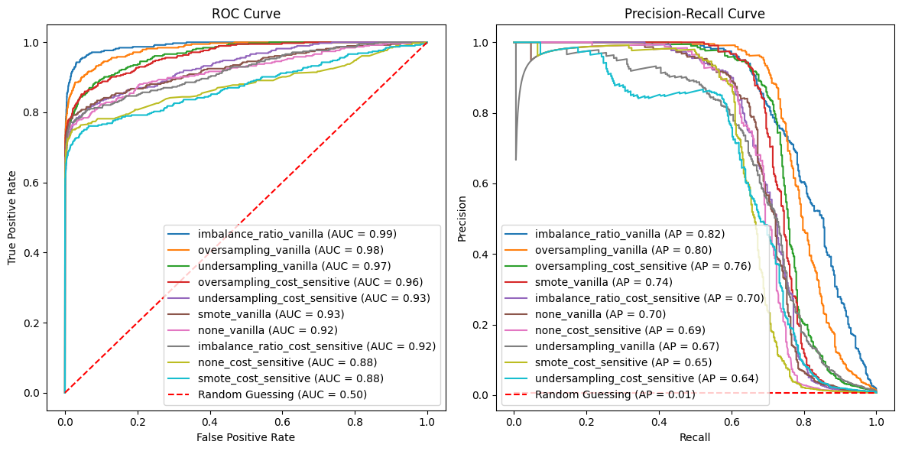

# 8. Cost-sensitive and imbalanced learning

Now another of the key ways that modeling fraud differs from modeling other things. Fraud is imbalanced in two ways: Fraud is rare. And the cost of false negatives (missing fraud) is typically much greater than the cost of false positives (flagging legit transactions as fraud).

## 8.1 Cost-sensitive learning

Suppose you estimate each false positive to cost $C_{FP}$ dollars and each false negative to cost 
$C_{FN}$.  An obvious way to incorporate these costs into the loss function is to set the class weights $s_i$ for $i\in\mathcal{D}$ to be  $C_{FN}$ for fraudulent transactions and 
$C_{FP}$ for legitimate transactions. That is:


$$
s_i := \begin{cases}
C_{FN} & \text{if } y_i = 1\\
C_{FP} & \text{if } y_i = 0
\end{cases}
$$

With these class weights, the cost-adjusted regularized log-loss function becomes:

$$\text{RegLogLoss}(f_{\mathbf{w}}, \mathbf{\lambda}) = \Omega (\mathbf{w},\mathbf{\lambda}) - \frac{\sum_{i=1}^n  
\left( C_{FN} \ y_i \ln f_{\mathbf{w}}(\mathbf{X}_i) + C_{FP} (1 - y_i) \ln(1 - f_{\mathbf{w}}(\mathbf{X}_i)) \right)}{\sum_{i=1}^n \left( C_{FN} \ y_i + C_{FP} (1 - y_i)\right)} $$


When training the model from already-tuned hyperparameters, the differential costs make assigning a fraud case a low probability a more costly error, all alse being equal, than assigning a legit transaction a high probability.  And if the measure of validation loss also incorporates these costs, they will similarly impact the hyperparameter tuning.

Suppose, for instance, that a false negative costs 20 times as much as a false positive.  For simplicity, let's say $C_{FN}=20$ and $C_{FP}=1$ and let's ignore the normalizing factor (which depends on the number of samples). Then predicting a fraudulent transaction to have only a 10% chance of being fraudulent adds 46 to the log-loss. But predicting a legitimate transaction to have a 90% chance of being fraudulent adds only 2 to the log-loss.  


<details>
<summary>Click to expand/hide Python code to generate the table and plot</summary>

<pre> ```python
import numpy as np
import matplotlib.pyplot as plt
import matplotlib as mpl
from matplotlib.colors import ListedColormap
import matplotlib.ticker as ticker

p = np.linspace(0.001, 0.999, 500)
cost_ratios = [1, 2, 5, 10, 20]

viridis_full = mpl.colormaps['viridis'](np.linspace(0, 1, 256))
start = int(0.1 * 256)
end = int(0.85 * 256)
viridis_trimmed = viridis_full[start:end]
custom_cmap = ListedColormap(viridis_trimmed)
colors = custom_cmap(np.linspace(0, 1, len(cost_ratios)))

plt.figure(figsize=(8, 5))
handles = []
labels = []

# Plot fraud curves and collect handles and labels
for cost_ratio, color in zip(cost_ratios, colors):
    log_loss_fraud = -np.log(p) * cost_ratio
    h, = plt.plot(p * 100, log_loss_fraud, label=f'Fraud (cost ratio={cost_ratio})', linestyle='--', color=color)
    handles.append(h)
    labels.append(f'Fraud (cost ratio={cost_ratio})')

# Plot legit curve
log_loss_legit = -np.log(1 - p)
h_legit, = plt.plot(p * 100, log_loss_legit, label='Legit (weight=1)', color='brown')

# Append the legit curve handle and label at the end
handles.append(h_legit)
labels.append('Legit (weight=1)')

# Create an ordering list:
# Indices of fraud curves sorted by decreasing cost ratio (since cost_ratios is increasing, reverse the order)
fraud_indices_desc = list(range(len(cost_ratios)-1, -1, -1))

# Append the legit curve index last
legend_order = fraud_indices_desc + [len(cost_ratios)]  # legit is last

# Reorder handles and labels according to desired legend order
handles_ordered = [handles[i] for i in legend_order]
labels_ordered = [labels[i] for i in legend_order]

plt.legend(handles_ordered, labels_ordered)
plt.title('Cost-Weighted Log-Loss Curves vs Predicted Probability')
plt.xlabel('Predicted Probability of Fraud (%)')
plt.ylabel('Log-Loss')
plt.grid(True)

# Add percent signs on the x-axis tick labels
plt.gca().xaxis.set_major_formatter(ticker.PercentFormatter(xmax=100))

plt.savefig("cost-wgted-log-loss-curves-vs-pred-prob.png", bbox_inches='tight')
plt.show()

p_values = [0.1, 0.9]
cost_ratios = [1, 2, 5, 10, 20]

def log_loss_fraud(p, cost_ratio):
    return -np.log(p) * cost_ratio

def log_loss_legit(p):
    return -np.log(1 - p)

rows = []
headers = ["Class / Cost Ratio", "Log-Loss at p=10%", "Log-Loss at p=90%"]

for cost_ratio in cost_ratios:
    row = [
        f"Fraud (cost ratio={cost_ratio})",
        f"{log_loss_fraud(0.1, cost_ratio):.4f}",
        f"{log_loss_fraud(0.9, cost_ratio):.4f}"
    ]
    rows.append(row)

# Add legit row
rows.append([
    "Legit (weight=1)",
    f"{log_loss_legit(0.1):.4f}",
    f"{log_loss_legit(0.9):.4f}"
])

# Print markdown table
print("| " + " | ".join(headers) + " |")
print("|" + "|".join(["---"] * len(headers)) + "|")
for row in rows:
    print("| " + " | ".join(row) + " |")

``` </pre>
</details>

<br>

| Class / Cost Ratio | Log-Loss at P(fraud)=10% | Log-Loss at P(fraud)=90% |
|---|---|---|
| Fraud (cost ratio=1) | 2.3026 | 0.1054 |
| Fraud (cost ratio=2) | 4.6052 | 0.2107 |
| Fraud (cost ratio=5) | 11.5129 | 0.5268 |
| Fraud (cost ratio=10) | 23.0259 | 1.0536 |
| Fraud (cost ratio=20) | 46.0517 | 2.1072 |
| Legit (weight=1) | 0.1054 | 2.3026 |

<br>


The Handbook says that it is difficult to estimate the costs of false positives and false negatives. (I'm guessing a card issuer would have a good sense of the cost of missing fraud, at least in terms of refunding cardholders for transactions they didn't authorize. And I'm guessing card issuers have a good sense of investigating wrongly flagged transactions that turn out to be legitimate. But maybe it's hard to estimate the costs of losing customers who get annoyed by declined transactions and holds placed on their cards?) 

When these costs can't be reasonably reliably estimated, the Handbook notes that a popular heuristic is to assume that false negatives cost $1/IR$ times as much as false positives, where the *imbalance ratio* $IR$ is defined as the ratio of fraudulent transactions to legitimate transactions. 

This heuristic doesn't sound unreasonable, but I don't want to mix up imbalanced learning and cost-sensitive learning. That is, one way to handle class imbalance is to upweight the minority class, regardless of whether you also incorporate the differential costs of misclassification. But you can also incorporate both concepts at once, learning in a manner that addresses both class imbalance and cost imbalance.  So let's explore this. 

## 8.2 Imbalanced learning

The Handbook explains various imbalance techniques, including: 
- oversampling: enlarging the training data with random duplicates of fraudulent transactions
- undersampling: shrinking the training data by randomly removing legitimate transactions 
- imbalance ratio: assigning sample weights of 1 to legitimate transactions and $1/IR$ to fraudulent transactions
- SMOTE: enlarging the training data with synthetically-generated fraud cases. The synthetic cases are made by selecting a fraudulent transaction and interpolating between it and one of its k nearest neighbor fraudulent transactions.

As an experiment, I appled each of these to XGBoost, both alone (called "vanilla" in the plots) and together with a cost of 1,500 dollars per false negative and 75 dollars per false positive (called "cost_sensitive" in the plots). For comparison, I also added XGBoost with just the cost-sensitive adjustment and XGBoost with neither adjustment. So, there were a total of 10 models.

In terms of AUC, average precision, CardPrecision@30, and CardRecall@30, most combinations outperformed the version without these imbalance adjustments.  But not always, and not by slam-dunk improvements.


<details>
<summary>Click to expand/hide Python code to fit XGBoost with the 10 combinations of imbalance adjustment and cost-sensitive learning </summary>

<pre> ```python
""" Run XGBoost 10 combinations of imbalance adjustment and cost-sensitive learning """

from imblearn.pipeline import Pipeline as ImbPipeline
from imblearn.over_sampling import SMOTE
from imblearn.under_sampling import RandomUnderSampler
from imblearn.over_sampling import RandomOverSampler
from scipy.special import expit as sigmoid  # Sigmoid function
from sklearn.base import clone

# Define sampler mapping
def get_sampler(method):
    if method == 'undersampling':
        return RandomUnderSampler(random_state=0)
    elif method == 'oversampling':
        return RandomOverSampler(random_state=0)
    elif method == 'smote':
        return SMOTE(random_state=0)
    else:
        return None  # For 'imbalance_ratio' and 'none'

# Setup pipelines (no sampling in pipeline yet)
pipelines = {
    'XGBoost': Pipeline([
        ('preprocessor', preprocessor),
        ('clf', XGBClassifier(random_state=0, use_label_encoder=False, eval_metric='logloss', n_jobs=-1))
    ])
}

# Function to calculate sample weights
def calc_sample_weights(y, cost_FP, cost_FN):
    return np.where(y == 1, cost_FN, cost_FP)


def run_imbalance_and_cost_sensitive_exp(
    df, pipelines, input_features, output_col,
    imbalance_methods=['imbalance_ratio', 'undersampling', 'oversampling', 'smote', 'none'],
    cost_FP=75, cost_FN=1500,
    start_date=datetime.datetime(2018, 7, 25),
    delta_train=7, delta_delay=7, delta_assessment=7,
    n_folds=4,
    n_iter=20,
    random_state=0
):
    rng = check_random_state(random_state)
    optimized_pipelines = {}

    for imb_method in imbalance_methods:
        for cost_sensitive in [False, True]:
            run_name = f"{imb_method}_{'cost_sensitive' if cost_sensitive else 'vanilla'}"
            print(f"Running experiment: {run_name}")

            pipeline_template = pipelines['XGBoost']  # Only XGB

            param_dist = {
                'clf__n_estimators': randint(50, 101),       # 50 to 100
                'clf__max_depth': randint(3, 8),             # 3 to 7
                'clf__learning_rate': uniform(0.01, 0.19),  # 0.01 to 0.2 approx
            }

            def fit_and_score(params):
                fold_scores = []
                fold_start = start_date
                for fold in range(n_folds):
                    train_df, val_df = get_train_val_split(df, fold, fold_start, delta_train, delta_delay, delta_assessment)
                    if train_df.empty or val_df.empty:
                        fold_start += datetime.timedelta(days=delta_assessment)
                        continue

                    X_train = train_df[input_features]
                    y_train = train_df[output_col]
                    X_val = val_df[input_features]
                    y_val = val_df[output_col]

                    model = clone(pipeline_template)
                    model.set_params(**params)

                    # Set scale_pos_weight or sample weights according to imb_method and cost_sensitive
                    if imb_method == 'none':
                        if cost_sensitive:
                            sample_weights = np.where(y_train==1, cost_FN, cost_FP)
                            model.set_params(clf__scale_pos_weight=1)
                            model.fit(X_train, y_train, clf__sample_weight=sample_weights)
                        else:
                            model.fit(X_train, y_train)
                    elif imb_method == 'imbalance_ratio':
                        n_pos = np.sum(y_train==1)
                        n_neg = np.sum(y_train==0)
                        spw = n_neg / max(1,n_pos)
                        spw *= (cost_FP / cost_FN if cost_sensitive else 1)
                        model.set_params(clf__scale_pos_weight=spw)
                        model.fit(X_train, y_train)
                    else:
                        # Use sampling methods
                        sampler = get_sampler(imb_method)
                        X_res, y_res = sampler.fit_resample(X_train, y_train)
                        sample_weights = np.where(y_res==1, cost_FN, cost_FP) if cost_sensitive else None
                        spw = (np.sum(y_res==0)/max(1,np.sum(y_res==1)))*(cost_FP/cost_FN if cost_sensitive else 1)
                        model.set_params(clf__scale_pos_weight=spw)
                        model.fit(X_res, y_res, clf__sample_weight=sample_weights)

                    y_pred_prob = model.predict_proba(X_val)
                    sample_weights_val = np.where(y_val==1, cost_FN, cost_FP) if cost_sensitive else None
                    loss = log_loss(y_val, y_pred_prob, sample_weight=sample_weights_val)
                    fold_scores.append(loss)
                    fold_start += datetime.timedelta(days=delta_assessment)

                return np.mean(fold_scores) if fold_scores else float('inf')

            best_score = float('inf')
            best_params = None
            best_model = None

            for params in list(ParameterSampler(param_dist, n_iter=n_iter, random_state=rng)):
                score = fit_and_score(params)
                print(f"Params {params} -> Score {score:.5f}")
                if score < best_score:
                    best_score = score
                    best_params = params

            # Fit model on full data
            final_model = clone(pipeline_template)
            final_model.set_params(**best_params)
            if imb_method == 'none':
                if cost_sensitive:
                    sample_weights_full = np.where(df[output_col]==1, cost_FN, cost_FP)
                    final_model.set_params(clf__scale_pos_weight=1)
                    final_model.fit(df[input_features], df[output_col], clf__sample_weight=sample_weights_full)
                else:
                    final_model.fit(df[input_features], df[output_col])
            elif imb_method == 'imbalance_ratio':
                n_pos_full = np.sum(df[output_col]==1)
                n_neg_full = np.sum(df[output_col]==0)
                spw_full = n_neg_full / max(1,n_pos_full)
                spw_full *= (cost_FP / cost_FN if cost_sensitive else 1)
                final_model.set_params(clf__scale_pos_weight=spw_full)
                final_model.fit(df[input_features], df[output_col])
            else:
                sampler = get_sampler(imb_method)
                X_res_full, y_res_full = sampler.fit_resample(df[input_features], df[output_col])
                sample_weights_full = np.where(y_res_full==1, cost_FN, cost_FP) if cost_sensitive else None
                spw_full = (np.sum(y_res_full==0)/max(1,np.sum(y_res_full==1)))*(cost_FP/cost_FN if cost_sensitive else 1)
                final_model.set_params(clf__scale_pos_weight=spw_full)
                final_model.fit(X_res_full, y_res_full, clf__sample_weight=sample_weights_full)

            optimized_pipelines[run_name] = {
                'model': final_model,
                'best_params': best_params,
                'best_score': best_score
            }

    return optimized_pipelines

result_pipelines = run_imbalance_and_cost_sensitive_exp(
    transactions_df,
    pipelines,
    input_features,
    'TX_FRAUD',
    imbalance_methods=['imbalance_ratio', 'undersampling', 'oversampling', 'smote', 'none'],
    cost_FP=75,
    cost_FN=1500,
    start_date=datetime.datetime(2018,7,25),
    delta_train=7,
    delta_delay=7,
    delta_assessment=7,
    n_folds=4,
    n_iter=20
)


``` </pre>
</details>


<br>


<details>
<summary>Click to expand/hide Python code to plot the 10 ROC curves and 10 precision-recall curves </summary>

<pre> ```python
X_test, y_test = test_df[input_features], test_df['TX_FRAUD']

model_name = 'XGBoost'
import matplotlib.pyplot as plt
from sklearn.metrics import roc_curve, auc, precision_recall_curve, average_precision_score

def plot_roc_pr_curves(pipelines, X_test, y_test):
    plt.figure(figsize=(14, 6))

    # Gather ROC data and sort by decreasing AUC
    roc_data = []
    for name, pipe_info in pipelines.items():
        model = pipe_info['model']  # Extract the actual model
        probs = model.predict_proba(X_test)[:, 1]
        fpr, tpr, _ = roc_curve(y_test, probs)
        roc_auc = auc(fpr, tpr)
        roc_data.append((name, fpr, tpr, roc_auc))
    roc_data.sort(key=lambda x: x[3], reverse=True)

    # Plot ROC Curve
    plt.subplot(1, 2, 1)
    for name, fpr, tpr, roc_auc in roc_data:
        plt.plot(fpr, tpr, label=f'{name} (AUC = {roc_auc:.2f})')
    random_roc_auc = 0.5
    plt.plot([0, 1], [0, 1], 'r--', label=f'Random Guessing (AUC = {random_roc_auc:.2f})')  
    plt.xlabel('False Positive Rate')
    plt.ylabel('True Positive Rate')
    plt.title('ROC Curve')
    plt.legend(loc='lower right')

    # Gather PR data and sort by decreasing AP
    pr_data = []
    for name, pipe_info in pipelines.items():
        model = pipe_info['model']
        probs = model.predict_proba(X_test)[:, 1]
        precision, recall, _ = precision_recall_curve(y_test, probs)
        ap = average_precision_score(y_test, probs)
        pr_data.append((name, recall, precision, ap))
    pr_data.sort(key=lambda x: x[3], reverse=True)

    # Plot Precision-Recall Curve
    plt.subplot(1, 2, 2)
    for name, recall, precision, ap in pr_data:
        plt.plot(recall, precision, label=f'{name} (AP = {ap:.2f})')
    # Add dashed line for random guessing (constant model)
    positive_rate = y_test.mean()
    random_ap = positive_rate
    plt.plot([0, 1], [positive_rate, positive_rate], 'r--', label=f'Random Guessing (AP = {random_ap:.2f})')
    plt.xlabel('Recall')
    plt.ylabel('Precision')
    plt.title('Precision-Recall Curve')
    # Place legend in lower left for PR curve with sorted entries
    plt.legend(loc='lower left')

    plt.tight_layout(rect=[0, 0, 0.85, 1])  # Make room on right for ROC legend
    plt.savefig(f"ROC-and-PR-curves-for-{model_name}-w-imb-from-test-data.png", bbox_inches='tight')
    plt.show()

plot_roc_pr_curves(result_pipelines, X_test, y_test)
``` </pre>
</details>

<br>



<br>

<details>
<summary>Click to expand/hide Python code to plot the 10 ROC curves and 10 precision-recall curves </summary>

<pre> ```python
import matplotlib.patches as patches

def plot_confidence_ellipse(
    x, y, ax, n_std=1.96, edgecolor='black', **kwargs
):
    if x.size != y.size:
        raise ValueError("x and y must be the same size")
    cov = np.cov(x, y)
    mean_x, mean_y = np.mean(x), np.mean(y)
    eigvals, eigvecs = np.linalg.eigh(cov)
    order = eigvals.argsort()[::-1]
    eigvals, eigvecs = eigvals[order], eigvecs[:, order]
    theta = np.degrees(np.arctan2(*eigvecs[:, 0][::-1]))
    width, height = 2 * n_std * np.sqrt(eigvals)
    ellipse = patches.Ellipse(
        (mean_x, mean_y), width, height, angle=theta,
        edgecolor=edgecolor, facecolor='none', **kwargs
    )
    ax.add_patch(ellipse)
    ax.scatter(mean_x, mean_y, color=edgecolor, s=60, edgecolors='k', zorder=10)

def plot_card_precision_recall_ellipse_by_time_and_model(
    optimized_pipelines,
    X_test,
    y_test,
    A,
    n_a,
    m_a,
    time_unit
):
    time_column_map = {
        'days': 'TX_TIME_DAYS',
        'hours': 'TX_TIME_HOURS',
        'minutes': 'TX_TIME_MINUTES',
        'seconds': 'TX_TIME_SECONDS',
    }
    time_unit_divisor = {
        'days': 30,
        'hours': 30 * 24,
        'minutes': 30 * 24 * 60,
        'seconds': 30 * 24 * 60 * 60
    }
    if time_unit not in time_column_map:
        raise ValueError(f"time_unit must be one of {list(time_column_map.keys())}")

    time_col = time_column_map[time_unit]
    divisor = time_unit_divisor.get(time_unit, 30)
    k_card = max(1, int((A * n_a) / divisor))

    df = pd.DataFrame({
        'time_period': X_test[time_col],
        'y_true': y_test,
    })

    has_customer = 'CUSTOMER_ID' in X_test.columns
    if has_customer:
        df['customer_id'] = X_test['CUSTOMER_ID']

    results_time = []
    drop_cols = time_columns + (['CUSTOMER_ID'] if has_customer else [])

    for name, pipe_info in optimized_pipelines.items():
        model = pipe_info['model']  # Extract the actual model
        X_pred = X_test.drop(columns=drop_cols)
        if hasattr(model, "predict_proba"):
            scores = model.predict_proba(X_pred)[:, 1]
        elif hasattr(model, "decision_function"):
            scores = model.decision_function(X_pred)
        else:
            scores = model.predict(X_pred)
        df['score'] = scores
        for t_val, grp in df.groupby('time_period'):
            if has_customer:
                agg = grp.groupby('customer_id').agg(
                    max_score=('score', 'max'),
                    card_true=('y_true', 'max')
                ).reset_index()
                p_c = card_precision_at_k(agg['card_true'], agg['max_score'], k_card)
                r_c = card_recall_at_k(agg['card_true'], agg['max_score'], k_card)
            else:
                p_c, r_c = np.nan, np.nan
            results_time.append({
                'time_period': t_val,
                'model': name,
                'card_precision@k': p_c,
                'card_recall@k': r_c
            })

    df_time = pd.DataFrame(results_time)
    models = df_time['model'].unique()

    # Collect mean recall and precision, compute distance for sorting
    mean_values = []
    for model in models:
        subset = df_time[df_time['model'] == model]
        mean_recall = np.mean(subset['card_recall@k'])
        mean_precision = np.mean(subset['card_precision@k'])
        dist = np.sqrt(mean_recall**2 + mean_precision**2)
        mean_values.append((model, mean_recall, mean_precision, dist))

    # Sort by distance descending
    mean_values.sort(key=lambda x: x[3], reverse=True)

    cmap = plt.get_cmap('tab10')
    colors = {mv[0]: cmap(i) for i, mv in enumerate(mean_values)}

    fig, ax1 = plt.subplots(1, 1, figsize=(10, 8))
    for model, mean_recall, mean_precision, _ in mean_values:
        subset = df_time[df_time['model'] == model]
        if len(subset) >= 2:
            plot_confidence_ellipse(
                subset['card_recall@k'].values,
                subset['card_precision@k'].values,
                ax1,
                n_std=1.96,
                edgecolor=colors[model]
            )
        ax1.scatter(
            mean_recall,
            mean_precision,
            color=colors[model],
            edgecolors='k',
            s=60,
            zorder=10,
            label=model
        )
        print(f"{model}: recall = {mean_recall:.4f}, precision = {mean_precision:.4f}")

    ax1.set_xlabel(f"CardRecall@{k_card}")
    ax1.set_ylabel(f"CardPrecision@{k_card}")
    ax1.set_title(f"95%-Confidence Ellipse for CardPrecision@{k_card} vs CardRecall@{k_card}, "
                  f"by Model (for a model deployed every {time_unit[:-1]})")
    handles, labels = ax1.get_legend_handles_labels()
    ax1.legend(handles, labels)
    ax1.grid(True)

    plt.savefig("Card-precision-and-recall-at-30-conf-ellipse-for-{model_name}-w-imb.png", bbox_inches='tight')
    plt.tight_layout()
    plt.show()

m_a = 2300                 # Average num txs reviewed per analyst per month (example)
n_a = 2160                 # Average num cards reviewed per analyst per month (example)
A = 10                    # Number of analysts employed 24/7

# Add TX_TIME_HOURS and TX_TIME_MINUTES (// rounds down, i.e. "floor division"), the hours & minutes from midnight on the day of the 1st tx
transactions_df['TX_TIME_MINUTES'] = transactions_df['TX_TIME_SECONDS'] // 60
transactions_df['TX_TIME_HOURS'] = transactions_df['TX_TIME_MINUTES'] // 60

(train_df, test_df)=get_train_test_set(transactions_df,start_date_training,
                                       delta_train=7,delta_delay=7,delta_test=7)

time_columns = ['TX_DATETIME', 'TX_TIME_DAYS', 'TX_TIME_HOURS', 'TX_TIME_MINUTES', 'TX_TIME_SECONDS']

X_test, y_test = test_df[input_features + time_columns + ['CUSTOMER_ID']], test_df['TX_FRAUD']


plot_card_precision_recall_ellipse_by_time_and_model(
    result_pipelines,
    X_test,
    y_test,
    A=A, n_a=n_a, m_a=m_a, time_unit='hours'
)

``` </pre>
</details>

<br>


<br>

<table width="100%">
  <tr>
    <td align="left">
      <a href="/7-the-cost-of-fraud-to-the-card-issuer.html">← Previous: 7. The cost of fraud</a>
    </td>
    <td align="right">
    <a href="/9-Databricks deployment.html">
      Next: 9. Databricks deployment →</a>
    </td>
  </tr>
</table>

